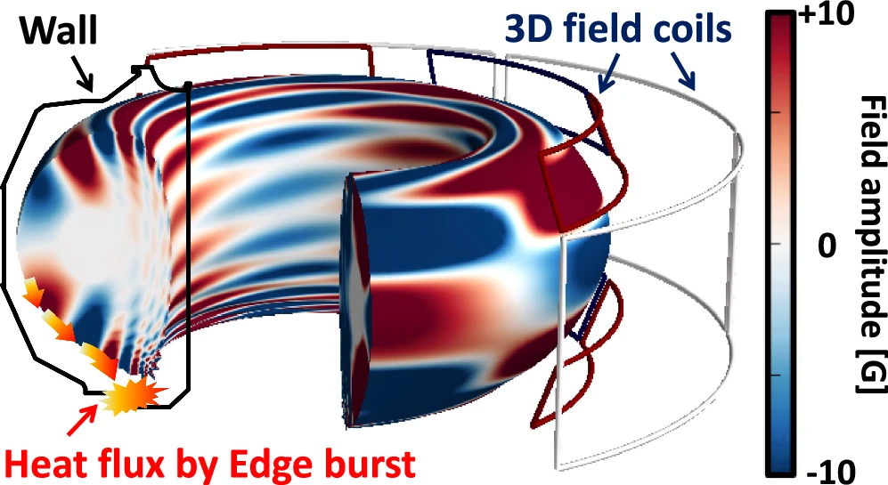
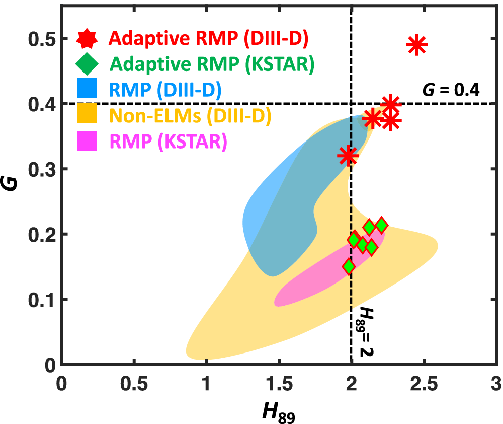

# Highest fusion performance without harmful edge energy bursts

Led by Sangkyeun Kim, we achieved the highest fusion performance without harmful edge energy bursts in two separate tokamaks, KSTAR and DIII-D. This work combined physics and AI to control the fusion plasma.

<!-- more --> 

**Article from Nature Communications**

<https://doi.org/10.1038/s41467-024-48415-w>

**Article from the Andlinger Center for Energy and the Environment**

<https://acee.princeton.edu/acee-news/ai-approach-elevates-plasma-performance-and-stability-across-fusion-devices/>

