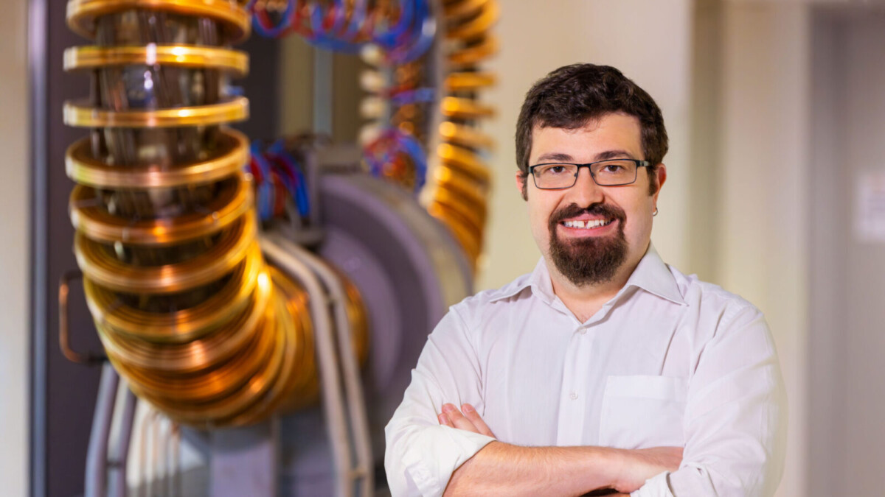

# Stabilizing fusion reactions is a learning process — for AI systems and the engineers who design them 

Controlling the superheated plasma that makes up the whirling core of a fusion reactor is simple. You just have to predict the future. 

<!-- more -->

Working with his research team at Princeton University and the Princeton Plasma Physics Lab, Egemen Kolemen *08 is using artificial intelligence to do just that. In a recent effort, Kolemen, an associate professor of mechanical and aerospace engineering and the Andlinger Center for Energy and the Environment, developed techniques that allow engineers to anticipate, and correct for, instabilities in plasma that can shut down a fusion reaction. 

In experiments at the DIII-D National Fusion Facility in San Diego, the researchers showed that their model, trained on data from previous tests, could forecast certain plasma instabilities up to 300 milliseconds in the future. That’s roughly the time it takes for a human to blink, but it was enough for an AI controller to change parameters and correct for the problem. 

Controlling plasmas is key to realizing nuclear fusion as a clean, safe, and abundant source of energy.

The research team is now working to improve the control system that handles the instabilities. Kolemen said they are also working to expand their control algorithm to handle many different types of problems at once. He described it as a learning process in which the AI is learning to better handle the plasma, and the researchers are learning to deploy the AI. 

By Alaina O’Regan.12

[Link](https://engineering.princeton.edu/news/2024/12/20/stabilizing-fusion-reactions-learning-process-ai-systems-and-engineers-who-design-them) to original article.