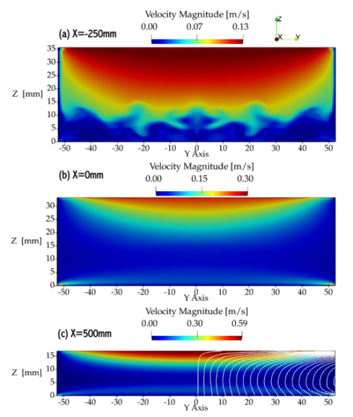

# Liquid Metals for Fusion Applications

In magnetic-confinement-fusion devices, reactor walls and the divertor act as plasma-facing components (PFC) that exhaust excessive heat-flux loads from the plasma. These heat loads were predicted to be ∼10 MW m2 without any fusion power released, and it is expected to increase up to ∼31 MW m2 for ITER in H-mode operation. These heat loads cause surface degradation of solid PFCs, and could dramatically reduce their lifetime to the order of hours. Current designs of solid PFCs require further developments to withstand such extreme conditions.

Nevertheless, liquid-metal-free-surface flows may address the aforementioned shortcomings of solid PFCs as they offer:

1. Higher heat transfer rates through convection and phase-change processes
2. Immediate material replenishment after plasma disruptions
3. Elimination of net-reshaping of the PFCs due to plasma erosion and or redeposition
4. Potentially decreasing the erosion lifetime requirements to ∼10 s – 100 s as Liquid-metal-PFCs (LMPFCs) are constantly replenished

Nevertheless, while the application of LMs in divertors and blankets is promising to handle the heat loads in future nuclear fusion reactors, the present knowledge and applications of LM flows in these environments is rather poor.

The Plasma Control Group performs fundamental research to address the operation of liquid metal flows subject to magnetic fields similar to those in reactor scenarios. Our research is generally focused on solving the issues and instabilities generated from MHD induced forces in a liquid metal flow. This research is mainly executed with the Liquid Metal eXperiment – Upgrade (LMX-U) at the Princeton Plasma Physics Laboratory. However, there are strong collaborations with other research institutions like National Institute for Fusion Science (Japan) , Kyushu University (Japan) and the Center for Plasma–Material Interactions at the University of Illinois Urbana-Champaign.

<iframe width="560" height="315" src="https://www.youtube.com/embed/nTwwzcniaXg?si=X8FFn36D2fFt8ety" title="YouTube video player" frameborder="0" allow="accelerometer; autoplay; clipboard-write; encrypted-media; gyroscope; picture-in-picture; web-share" referrerpolicy="strict-origin-when-cross-origin" allowfullscreen></iframe>

## Liquid Metal eXperiment Upgrade (LMX-U)

LMX-U (Liquid Metal eXperiment Upgrade) is a liquid metal loop capable of free-surface liquid metal flow within a magnetic field. The working fluid of LMX-U is galinstan (GaInSn eutectic), a non-toxic and non-reactive liquid metal that stays liquid down to -19˚C. Galinstan is pumped from an outlet tank up to an adjustable inlet nozzle that controls the flow depth. The channel itself is situated within a C-shaped electromagnet capable of up to 0.33 T. At either end of the channel are electrodes that allow for the injection of external electrical current up to 140 A.

Interaction of the electrical current and magnetic field leads to a Lorentz force (jxB) that acts as a body force on the galinstan. The Kolemen group researches the effect of this force on various hydrodynamic flow phenomena such as depth change, hydraulic jump and wave behavior.

## Magnetohydrodynamic drag in liquid metal flows

While flowing Liquid Metal (LM) Plasma-Facing Components (PFCs) represent a potentially transformative technology to enable long-pulse operation with high-power exhaust for fusion reactors, Magnetohydrodynamic (MHD) drag in the conducting LM will reduce the flow speed. Experiments have been completed in the linear open-channel LMX-U device for validation of MHD drag calculations with either insulating or conducting walls, with codes similar to those used to design flowing LM PFCs for a Fusion Nuclear Science Facility. We observe that the average channel flow speed decreased with the use of conducting walls and the strength of the applied transverse magnetic field. The MHD drag from the retarding Lorentz force resulted in an increase of the LM depth in the channel that ‘piled up’ near the inlet, but not the outlet. As reproduced by OpenFOAM and ANSYS CFX calculations, the magnitude and characteristics of the pileup in the flow direction increased with the applied traverse magnetic field by up to 120%, as compared to the case without an applied magnetic field, corresponding to an average velocity reduction of ∼45%. Particle tracking measurements confirmed a predicted shear in the flow speed, with the surface velocity increasing by 300%, despite the 45% drop in the average bulk speed. The MHD effect makes the bulk flow laminarized but keeps surface waves aligned along the magnetic field lines due to the anisotropy of MHD drag. The 3D fringe field and high surface velocity generate ripples around the outlet region. It was also confirmed that the MHD drag strongly depends on the conductivity of the channel walls, magnetic field, and volumetric flow rate, in agreement with the simulations and a developed analytical model. These validated models are now available to begin to determine the conditions under which the ideal LM channel design of a constant flow speed and fluid depth could be attained.

## Lorentz-force propulsion ($\bold{J} \times \bold{B}$)

Divertor systems of fusion devices are exposed to intense heat loads from plasmas, which degrade solid plasma-facing components (PFCs). Fast liquid metal (LM) flow divertors may be more advantageous for this purpose but have risk of piling due to intense magnetohydrodynamic (MHD) drag. However, severe deceleration of the flow could be countered with the injection of currents that are transverse to external magnetic fields, allowing to thrust the flow with jxB (Lorentz) forces. Given that the injection of currents as an approach to propel LM-divertor flows has remained experimentally understudied, this article focuses on the evaluation of jxB-thrust and finding its drawbacks.

jxB-thrust was experimentally tested with free-surface-LM flows, a vertical magnetic field and an externally applied current. Experiments were reviewed with a theoretical model, showing agreement in the trends of theory and experiments. Full 3D-MHD-free-surface flow simulations were also performed with FreeMHD and confirmed the sensitivity to unstable flow behavior in LM systems when applying external currents. Furthermore, excessive power requirements are expected for the implementation of jxB-thrust at the reactor scale, making these systems inefficient for commercial devices. The simple operation of a LM-flow divertor with jxB-thrust, without any of the instabilities caused from reactor plasmas or parasitic currents, already presents intrinsic challenges.

## Divertorlets concept for low-recycling slow-flow liquid-metal divertors of fusion reactors

The “divertorlets” concept is a potential non-evaporative liquid metal solution for heat removal at low recycling regime. It combines advantages of slow and fast flow speed regimes, achieving reduced MHD drag with small risk of liquid metal piling and splashing. The Plasma Control Group builds prototypes to test the performance of divertorlets at different reactor-relevant conditions. Experiments and simulations performed are proving the concept to be a compelling solution for divertor applications.

## FreeMHD

FreeMHD is an open source magnetohydrodynamics (MHD) solver, recently developed for free-surface liquid metal (LM) flows under strong magnetic fields. The extreme heat fluxes > 10 MW/m2 in the divertor region of tokamaks may require an alternative to solid plasma-facing components, for the extraction of heat and the protection of the surrounding walls. However, codes to simulate the behavior of free-surface LM under fusion-relevant conditions are not available. Previous numerical studies have mainly used steady-state, 2D, or simplified models for internal flows and have not been able to adequately model free-surface LM experiments. Therefore, FreeMHD, aims to compute incompressible free-surface flows with multi-region coupling for the investigation of MHD phenomena involving fluid and solid domains. The objectives of the project involve validation and verification of FreeMHD to solve fully 3D transient MHD flows. The model utilizes the electric potential formulation to solve the inductionless MHD equations, implemented using the open-source, finite-volume OpenFOAM framework. FreeMHD is validated using analytical solutions for closed channel flows by examining the effect on the closed channel velocity profile and pressure drop while varying the Hartmann number and wall conductance ratio. Experimental measurements of liquid metal depth and velocity are then used to verify FreeMHD for free-surface LM flow on the Liquid Metal eXperiment Upgrade.

Our previous publications show the application of the FreeMHD tool on liquid metal simulations. Here are the presentations and publications where FreeMHD was used.

FreeMHD GitHub Repository: [github.com/PlasmaControl/FreeMHD](https://github.com/PlasmaControl/FreeMHD)

## Lithium/Lithium Hydride separation

A liquid metal centrifuge is being developed for the extraction of deuterium and tritium from lithium inventory in a closed-loop liquid metal system. Dilute solutions of lithium tritide (LiT) and lithium deuteride (LiD) will form when the temperature of the mixture of deuterium and tritium in lithium is reduced. The large density differences of LiD and LiT compared to pure liquid lithium will be utilized for the separation into an enriched slurry, which can be later broken down through electron beam heating. The magnetic centrifuge system is being designed based on an electromagnetic liquid metal (EMLM) pumping method. The magnetohydrodynamic (MHD) effects of Lorentz forces are implemented for liquid metal circulation, with externally applied magnetic fields and current driving the flow. A centrifuge system is under design at PPPL and will be first tested with galinstan (67% Gallium, 20.5% Indium, and 12.5% Tin) separating crystal impurities. Simulations are performed to characterize performance of the galinstan centrifuge, and compared to experimental results. The next iteration will be a system for liquid lithium, running experiments at Illinois for lithium hydride (LiH) separation using the density differences between Li and LiH.

