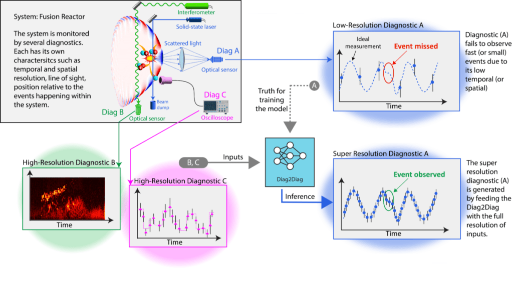
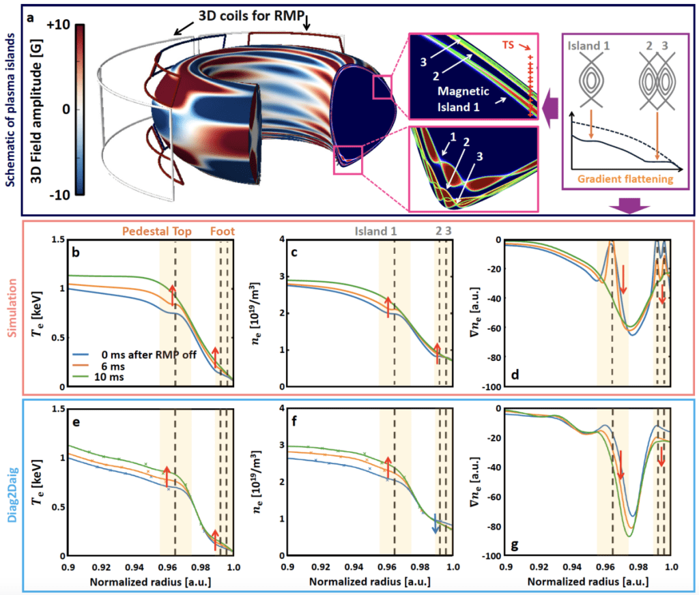
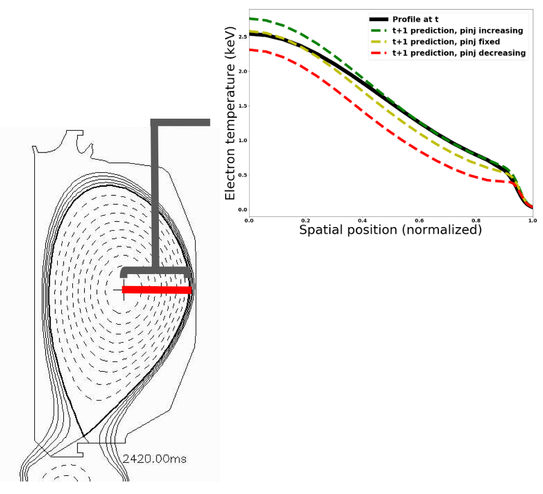
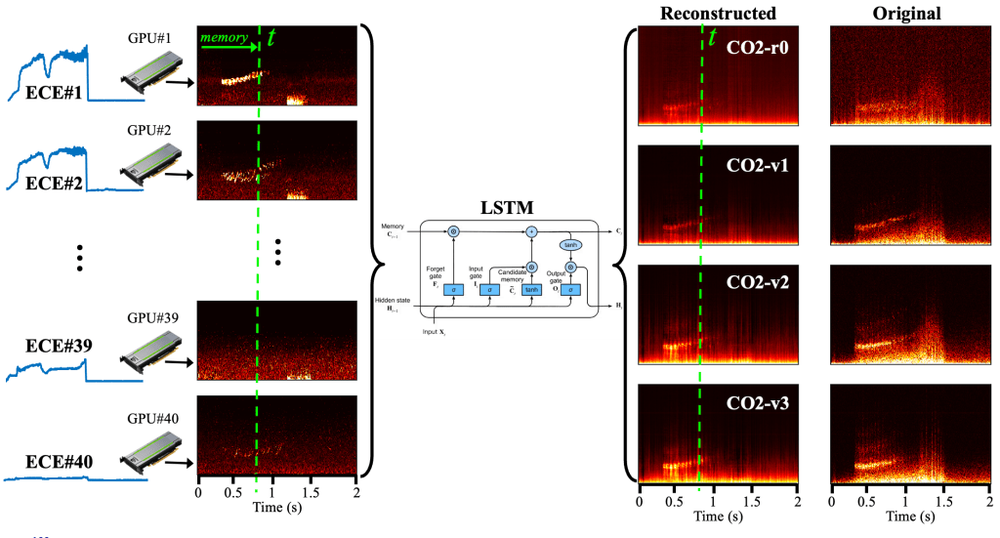
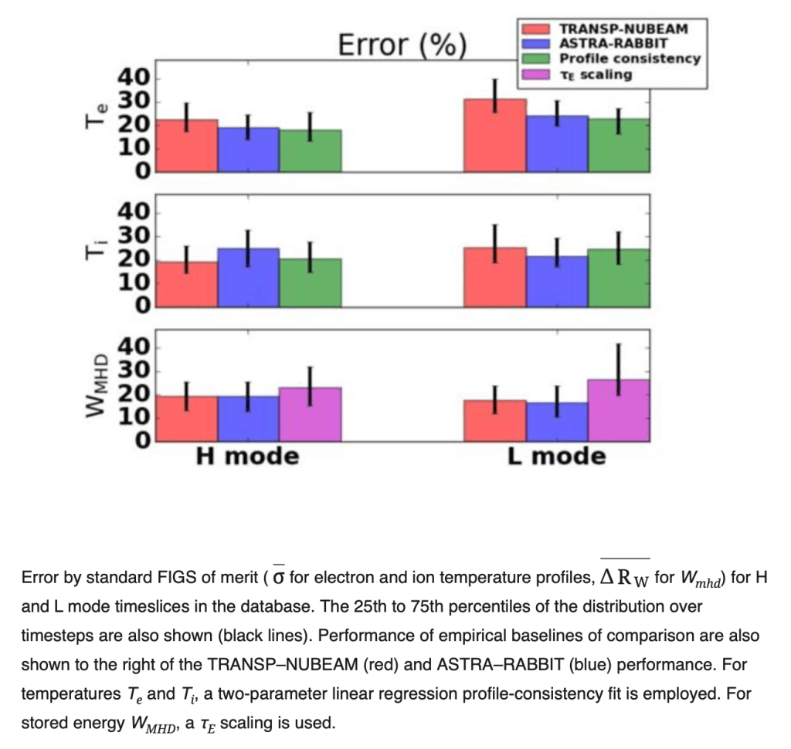

# Machine Learning for Real Time Control

## Discovering hidden physics using multimodal super-resolution (Diag2Diag)

A non-linear complex system governed by multi-spatial and multi-temporal physics scales cannot be fully understood with a single diagnostic, because each diagnostic provides only a partial view and much information is lost while extracting physical quantities from its raw measurements. Also, combining multiple diagnostics results in multiple imperfect projections of the system's physics. By identifying hidden inter-correlations between diagnostics, we can leverage mutual support to fill in these gaps. However, uncovering these inter-correlations analytically is too complex to be achieved analytically. We introduce a groundbreaking machine learning methodology to address this issue. Our multimodal approach generates super-resolution data encompassing multiple physics phenomena, enabling the capture of detailed structural evolution and responses to perturbations previously unobservable. This methodology addresses a critical problem in fusion plasmas: the Edge Localized Mode (ELM), a plasma instability that can severely damage reactor walls. One method to stabilize ELM is by using resonant magnetic perturbation to trigger magnetic islands. However, the low spatial and temporal resolution of measurements severely limits the analysis of these magnetic islands due to their small size, rapid dynamics, and complex interactions within the plasma. With super-resolution diagnostics, we can now experimentally verify theoretical models of magnetic islands for the first time, providing unprecedented insights into their role in ELM  stabilization. This advancement will aid in developing effective ELM suppression strategies for future fusion reactors like ITER. Our methodology has broader applications, potentially revolutionizing diagnostics in fields such as astronomy, astrophysics, and medical imaging.

Structure of 3D coils and islands by perturbed field (a), and the evidence in the simulation (b-d) and the Super Resolutionn Thomson Scattering diagnostic (e-g) for RMP-induced island mechanism on the plasma boundary in DIII-D shot 157545. Here, the Chebyshev filter is used to derive a statistically reliable time trace of the profile, leveraging the enhanced temporal resolution.

## Machine Learning for RT Profile Control in Tokamaks

In tokamaks, operators are able to control plasmas through a variety of "actuators" during shots: from neutral beams that heat and rotate the plasma, to coils which induce plasma current. Experimental proposals entail physicists specifying a desired plasma "state" of interest, which can be described by profiles of density, temperature, pressure, safety factor (q), and rotation. Operators and physicists usually work together to pre-specify a "path" of actuator signals through time that will successfully realize the state, using feedback control for realtime adjustments. However, the process of finding a successful actuator path is difficult and entails a lot of trial-and-error. "Model-predictive control" could make this process more efficient, saving physicists time and ensuring more successful physics experiments during future tokamak campaigns. In model-predictive control, a realtime model predicts the way the plasma state will evolve given various settings on actuators, then chooses settings which yield the plasma state closest to the physicist's desired end-state. Realtime physics models are not always accurate for regimes of interest. We are therefore developing a machine-learning model which generates a single prediction in under 100 microseconds, using only realtime diagnostics.

Algorithm would choose to increase the "pinj" signal to move the plasma toward the highest temperature profile (shown in green).

## Plasma Behavior Monitoring using High Resolution Diagnostics

Plasma Control Group is leading a multi-institutional research project to investigate machine learning for real-time fusion plasma behavior monitoring using high resolution diagnostics. We focus on two tracks of research; (1) detecting and classifying instabilities such as Alfven-Eigen (AE) modes in the core of plasma based on Electron Cyclotron Emission signals (2) developing a general framework for preprocessing such data, e.g., denoising spectrograms, before feeding them to the ML model.\
We develop several ML models to classify five AE modes, namely, BAAE, BAE, EAE, RSAE, TAE in a dataset of ~1000 discharges. We particularly pay attention to the ML models such as Reservoir Computing Networks which are easy to train yet effective in processing temporal information in time-series data such as ECE. Figure below shows the performance of a 2-layer RC model which has been trained on down-sampled ECE signals (from 500KHz to 1KHz). Our preliminary experiments show a hit rate of ~90% in detecting AE modes.

The ECE processing pipeline for detecting AE activities of DIII-D shot #193348. 40 ECE spectrograms are enhanced using denoising auto-encoders and are fed to a recurrent neural network that has been trained to detect AE activities at each time step.

## Diagnostic reduction and diagnostic upsampling using data-driven approaches

In fusion research devices and reactors, diagnostic data's accuracy and breadth are critical to understanding and achieving optimal performance. However, the design and operational constraints of pilot plants, such as ITER, often limit the availability and scope of these diagnostics. We are working on pioneering machine learning-based approaches to synthetic diagnostics that aims to circumvent such limitations. Leveraging neural network (NN) and parallel GPU processing, we successfully recreated diagnostic signals, emphasizing both spectrograms and amplitude reconstructions. Our approach not only allows for enhanced signal visualization but also provides a potential solution to diagnostic restrictions in future fusion reactors. Preliminary results indicate promising accuracy in signal reconstructions, highlighting the feasibility and significance of integrating machine learning techniques in fusion research.

## Large-database cross-verification and validation of tokamak transport models using baselines for comparison

This comprehensive cross-verification and validation process, which employed many DIII-D discharges to ensure statistical significance, aimed to enhance the reliability of tokamak transport predictions, which are crucial for the development and operation of tokamaks. We also discuss various validation metrics and methodologies, contributing to the ongoing refinement of predictive modeling in fusion research.

This work which has been published in Plasma of Physics (*Phys. Plasmas* 31, 042506, 2024) delves into the validation of tokamak transport models, specifically focusing on the 1D transport solvers ASTRA and TRANSP. These solvers were tested across a large database of DIII-D discharges, using empirical models as benchmarks. Our study found that while these advanced simulators demonstrated significant accuracy in predicting stored energy, they did not show a statistical advantage over simpler empirical models for predicting plasma temperature profiles.

## Stable Divertor Radiation Detachment with Real-Time Carbon-III Emission Front Proxy

Stable divertor detachment will allow tokamaks to maintain good confinement while preventing critical divertor plate damage due to excessive heat flux. Common methods including Langmuir probe (LP) divertor control or bolometry power integration contend with issues involving signal saturation or costly lower resolution resolves. A dynamic camera control system can cheaply substitute for these systems by leveraging the direct relation between C-III impurity emissions and plasma detachment. A machine-learning algorithm can directly find detachment values of interest anywhere within the tokamak. It can then adjust the actuation signal as necessary. This can be carried out in the span of milliseconds, allowing for both L-mode and rev-B H-mode emission front control.
