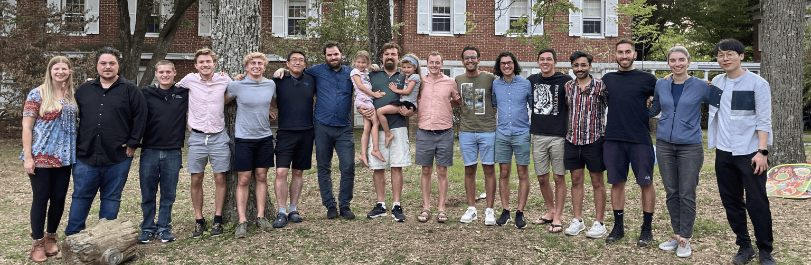

# Members

{ #group-photo }



## {{ people_category }}



    <h3 id="{{ person.h3_id }}">
        {{ person.name }} ({{ person.title }}) 
        <a class="headerlink" href="#{{ person.h3_id }}" title="Permanent link">¶</a>
    </h3>

    

        

            

            
{{ person.links }}

        

        

    
{{ person.description }}

    
    
<strong>Contact: </strong>{{ person.emails_html_urls }}

    
        

    






## Past Members


-  **{{ person.name }}**

    ---
    



