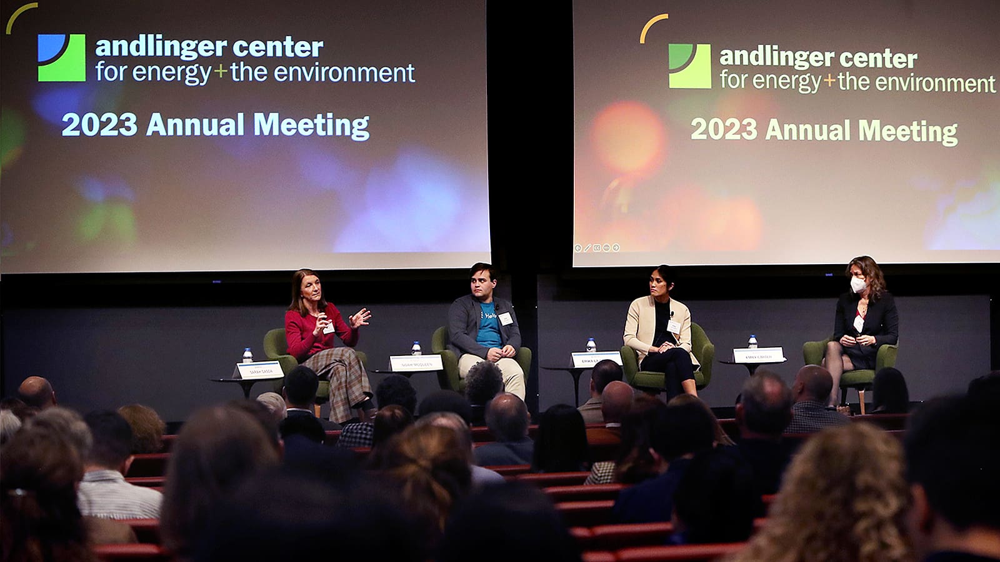
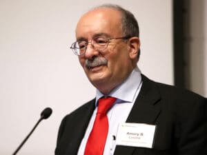
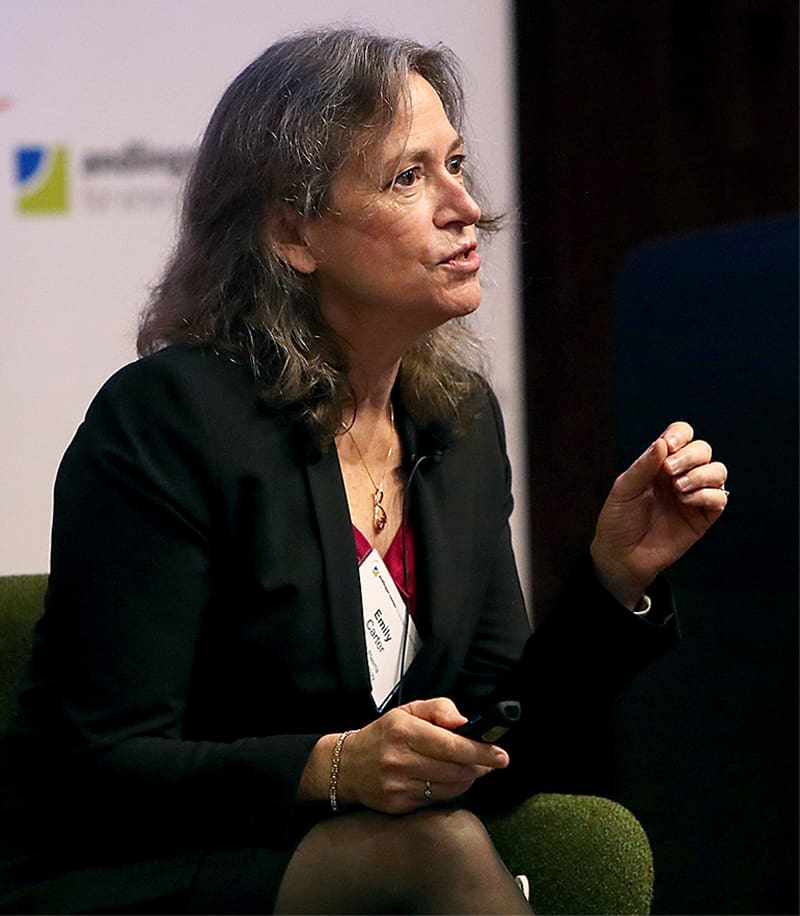
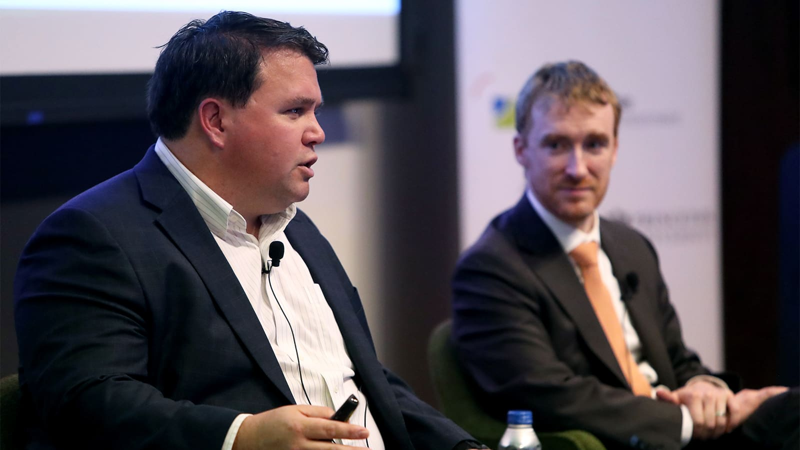
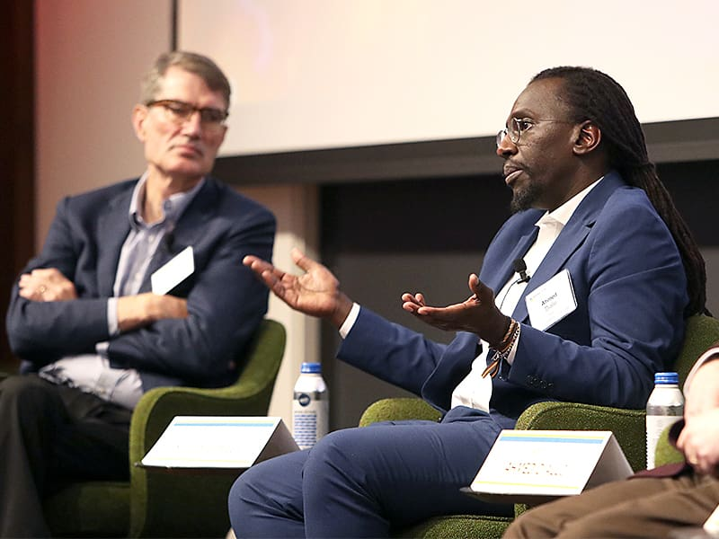
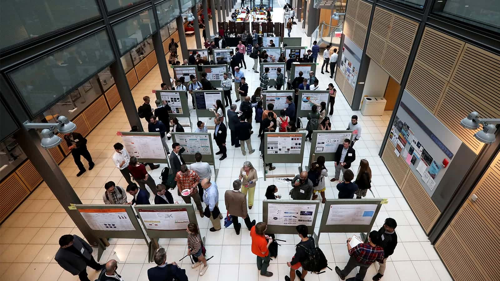

# Andlinger Center meeting spotlights next-decade technologies and design approaches for the clean energy transition

There is no one-size-fits-all solution to the clean energy transition, experts agreed at the Andlinger Center’s 12th annual meeting.

<!-- more -->

Instead, speakers and panelists at the day-long event emphasized the wide variety of approaches — technological as well as design — that countries will need to cut their carbon emissions. The October 27 meeting emphasized solutions that are currently underappreciated or at low technology readiness levels but might play central roles in the next decade’s energy system, including carbon capture, utilization, and storage (CCUS); hydrogen; and fusion.

“It’s clear that no single technology, or even a single set of existing technologies, provides an immediate path toward the goal of net-zero emissions,” said Claire Gmachl, interim director of the [Andlinger Center for Energy and the Environment](https://acee.princeton.edu/) and the Eugene Higgins Professor of Electrical Engineering, in her welcoming remarks. “It is in this spirit that we meet today to think about what our energy future will look like.”

The keynote address, given by Amory Lovins, co-founder and chairman emeritus of the non-profit RMI, spotlighted energy efficiency as a critical yet overlooked lever to rapid decarbonization. His talk centered on integrative design methods that could dramatically reduce overall energy demand, complementing new technologies to boost the renewable energy supply.

“What we need is not just deployment, but discernment about the \[energy\] supply that we will actually need,” said Lovins, who is also an adjunct professor of civil and environmental engineering at Stanford University.

Energy savings — about two-thirds from efficiency improvements in buildings, vehicles, and factories — have yielded, he argued, 27-fold greater cumulative U.S. reductions in total energy use since 1975 than the expansion of renewables. Moreover, such energy efficiency improvements usually hinge not on development and deployment of new technologies but instead on the scaling-up of new design approaches.

“Many of these \[energy efficiency\] techniques have been around for well over a decade. What’s mainly improved is not the technology but the design — the way we put the pieces together,” said Lovins.

### **Carbon capture, utilization, and storage (CCUS): Co-production, co-location, and co-benefits**

The day’s first panel highlighted CCUS, in which carbon dioxide is captured from a point source, ambient air, or a body of water, and then is either used to create a valuable product or stored in a stable environment.

For instance, Erika La Plante, co-founder of the startup Equatic, spoke about the company’s unique carbon capture technology that removes carbon dioxide from the ocean and the atmosphere and stores it as carbonate minerals and dissolved ions. The electrolytic process also generates carbon-negative hydrogen, a valuable energy commodity.

“By having a single process that produces two valuable products, it allows us to dramatically reduce our costs and increase the long-term scalability of our technology,” said La Plante, who is also an assistant professor of materials science and engineering at the University of California, Davis.

[Emily A. Carter](https://engineering.princeton.edu/faculty/emily-carter), the panel’s moderator, spoke about opportunities for carbon utilization, discussing the advantages of clustering carbon capture, clean energy, and manufacturing facilities wherever possible to reduce the need for additional infrastructure buildout. Carter is the Gerhard R. Andlinger Professor of Energy and the Environment and senior strategic advisor and associate laboratory director for applied materials and sustainability sciences at the [Princeton Plasma Physics Laboratory](https://www.pppl.gov/) (PPPL).

“We should take advantage of the fact that there is already an infrastructure for chemical transformation on which CCUS infrastructure can piggyback. For example, you could imagine a direct-air capture facility sited next to an existing chemical manufacturing facility. That would remove the need to build a pipeline,” she said.

Alongside the advantages of co-production and co-location, Noah McQueen, co-founder and head of research at Heirloom, said that if done responsibly, CCUS presents an opportunity to cultivate co-benefits between communities and companies. McQueen emphasized that early and honest conversations will be critical for building trust between CCUS companies and local stakeholders.

“There needs to be a dialogue between not only technology developers, but also among policymakers and regulators at a federal, state, and local level,” McQueen said. “We need to start conversations about what it looks like to responsibly deploy these technologies and the standards we need to hold technology developers to.”

Another way to facilitate trust-building is through public outreach and education. Panelist Sarah Gasda, research director and chief scientist in computational geosciences at the NORCE Norwegian Research Centre, referenced a mobile demonstration experiment developed at the University of Bergen in Norway in which carbon dioxide is injected into a tank of sand to mimic the process of geologic carbon storage, clearly illustrating the sequestering mechanisms that occur thousands of feet below the Earth’s surface.

“Once you can explain some of the underlying science to people using pictures or a live demonstration, they can start to get a grip of what all of this means to them,” said Gasda, who is also a professor of physics and technology at the University of Bergen.

### **Hydrogen: Keeping every option open**

A panel on hydrogen’s role in a clean energy future spotlighted the variety of approaches needed to build a robust roadmap to decarbonization.

[Michael E. Mueller](https://engineering.princeton.edu/faculty/michael-mueller), the session’s moderator and associate chair and professor of [mechanical and aerospace engineering](https://mae.princeton.edu/), began with an overview of the hydrogen ecosystem, including the hydrogen “color wheel.” Each color on the wheel corresponds to a different hydrogen production method, from today’s most common steam-methane reforming (grey hydrogen) to electrolysis (green hydrogen), methane pyrolysis (turquoise hydrogen), and geological hydrogen (white hydrogen). He then discussed the role of alternative hydrogen carriers such as ammonia.

In terms of hydrogen’s role in decarbonization, panelist Jeffrey Goldmeer, Global Hydrogen Value Chain Leader at GE Vernova, said, “It’s not an ‘or’ problem. It’s an ‘and’ problem. We need each of these technologies because each country is on its own decarbonization journey. There will not be a singular global energy solution.”

For instance, Goldmeer pointed out that countries like Singapore and Japan, with limited room for renewable energy, will have a different strategy for decarbonization than countries like the U.S.

Jennifer Kurtz, director of the Energy Conversion and Storage Systems Center at the [National Renewable Energy Laboratory](https://www.nrel.gov/) (NREL), discussed the importance of bringing a systems perspective to the energy transition, mapping out cost, efficiency, and reliability targets to identify where innovation is most needed along the hydrogen value chain to integrate hydrogen into a future energy system.

“I think we still have huge questions about almost every aspect of the energy transition,” said Kurtz, who also serves as the technical lead for the Advanced Research on Integrated Energy Systems (ARIES) at NREL. “But I believe in our ability to rise to the challenge and answer them.”

### **Fusion: Partnering on the pathway to net-zero**

The final panel combined public, private, and academic perspectives to chart a pathway for integrating fusion into the U.S. energy system.

Moderated by [Egemen Kolemen](https://engineering.princeton.edu/faculty/egemen-kolemen), associate professor of mechanical and aerospace engineering and the Andlinger Center for Energy and the Environment and staff research physicist at PPPL, the panel delved into the key role of public-private partnerships in achieving the Biden-Harris Administration’s [Bold Decadal Vision for Commercial Fusion Energy](https://www.whitehouse.gov/ostp/news-updates/2022/04/19/readout-of-the-white-house-summit-on-developing-a-bold-decadal-vision-for-commercial-fusion-energy/), which calls for fusion pilot plants and first-of-a-kind commercial plants to be deployed in the 2030s.

Steve Cowley, laboratory director of PPPL and professor of astrophysical sciences, discussed new programs, such as the [Milestone-Based Fusion Development Program](https://www.energy.gov/science/articles/department-energy-announces-50-million-milestone-based-fusion-development-program), that create an opportunity for private fusion companies to partner with fusion researchers at national labs and universities.

“We’re trying to use the best of what the public sector has, which is an immense base of knowledge in science and engineering, to help people advance their ideas towards fusion,” Cowley said. At the same time, Cowley said that supporting a diverse set of proposed fusion designs ensures that the public sector does not get caught in any “blind alleys” for fusion technologies that end up not working.

Ahmed Diallo, program director at the U.S. Department of Energy’s Advanced Research Projects Agency-Energy (ARPA-E) and Distinguished Research Fellow and principal research physicist at PPPL, discussed other programs like the [Innovation Network for Fusion Energy](https://infuse.ornl.gov/) (INFUSE) program, which enable private fusion companies to access the expertise of researchers at national labs and universities.

Such partnerships could reimagine the field of fusion research by encouraging more rapid technology development and deployment. David Gates, chief technology officer at fusion startup company Thea Energy, said the collaborations give companies valuable access to fusion experts.

“In fusion, I am looking for a specific niche of people that are very hard to find,” Gates said. “There may be only a handful of stellarator design experts across the country. But being able to work with national labs helps to solve the problem.”

At the same time, the partnerships help the public sector to consider and address the full range engineering and economic challenges of bringing fusion to the grid, beyond the work being done at national labs and universities to understand the fundamental science of fusion experiments.

“In the fusion research program, especially in the U.S., we’ve tended to tackle challenges serially,” Gates said. “We need to be launching things on multiple fronts. We need to be tackling challenges in parallel.”

[Barry Rand](https://engineering.princeton.edu/faculty/barry-rand), associate director for external partnerships at the Andlinger Center, said the emphasis on collaboration raised by the fusion panel spoke to some of the Andlinger Center’s core strengths. “In all of our work, we embrace a multidisciplinary, multistakeholder approach to develop solutions for our energy and environmental future,” said Rand, who is also a professor of [electrical and computer engineering](https://ece.princeton.edu/) and the Andlinger Center for Energy and the Environment. “Today’s meeting has made it clear that we can and should pursue every clean energy option, that we can pursue the low-hanging energy efficiency upgrades proposed by Professor Lovins, all while we prepare new technologies for deployment in the coming decades.”

