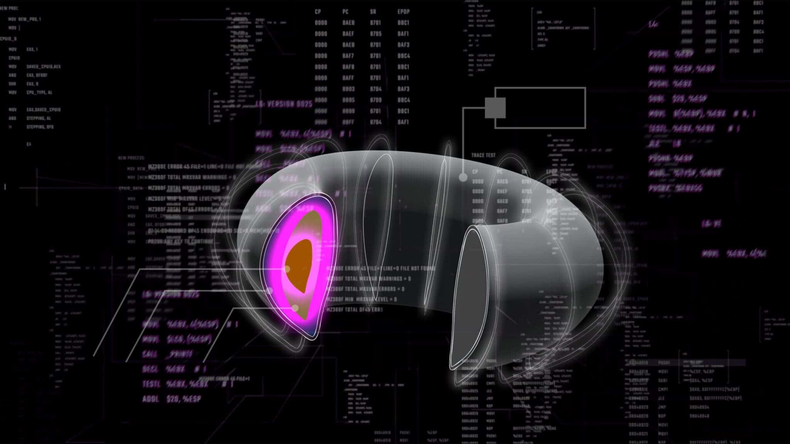
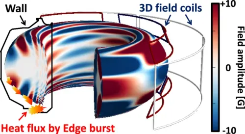
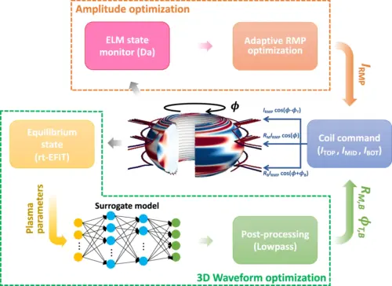

# AI approach elevates plasma performance and stability across fusion devices

Achieving a sustained fusion reaction is a delicate balancing act, requiring a sea of moving parts to come together to maintain a high-performing plasma: one that is dense enough, hot enough, and confined for long enough for fusion to take place.

<!-- more --> 

Yet as researchers push the limits of plasma performance, they have encountered new challenges for keeping plasmas under control, including one that involves bursts of energy escaping from the edge of a super-hot plasma. These edge bursts negatively impact overall performance and even damage the plasma-facing components of a reactor over time.

Now, a team of fusion researchers led by engineers at Princeton and the U.S. Department of Energy’s [Princeton Plasma Physics Laboratory](https://www.pppl.gov/) (PPPL) have successfully deployed machine learning methods to suppress these harmful edge instabilities — without sacrificing plasma performance.

With their approach, which optimizes the system’s suppression response in real-time, the research team demonstrated the highest fusion performance without the presence of edge bursts at two different fusion facilities — each with its own set of operating parameters. The researchers reported their [findings](https://www.nature.com/articles/s41467-024-48415-w) on May 11 in Nature Communications, underscoring the vast potential of machine learning and other artificial intelligence systems to quickly quash plasma instabilities.

“Not only did we show our approach was capable of maintaining a high-performing plasma without instabilities, but we also showed that it can work at two different facilities,” said research leader [Egemen Kolemen](https://engineering.princeton.edu/faculty/egemen-kolemen), associate professor of [mechanical and aerospace engineering](https://mae.princeton.edu/) and the [Andlinger Center for Energy and the Environment](https://acee.princeton.edu/). “We demonstrated that our approach is not just effective — it’s versatile as well.”

## The costs of high-confinement

Researchers have long experimented with various ways to operate fusion reactors to achieve the necessary conditions for fusion. Among the most promising approaches involves operating a reactor in high-confinement mode, a regime characterized by the formation of a steep pressure gradient at the plasma’s edge that offers enhanced plasma confinement.

However, the high-confinement mode has historically come hand-in-hand with instabilities at the plasma’s edge, a challenge that has required fusion researchers to find creative workarounds.

One fix involves using the magnetic coils that surround a fusion reactor to apply magnetic fields to the edge of the plasma, breaking up the structures that might otherwise develop into a full-fledged edge instability. Yet this solution is imperfect: while successful at stabilizing the plasma, applying these magnetic perturbations typically leads to lower overall performance.

“We have a way to control these instabilities, but in turn, we’ve had to sacrifice performance, which is one of the main motivations for operating in the high-confinement mode in the first place,” said Kolemen, who is also a staff research physicist at PPPL.

The performance loss is partly due to the difficulty of optimizing the shape and amplitude of the applied magnetic perturbations, which in turn stems from the computational intensity of existing physics-based optimization approaches. These conventional methods involve a set of complex equations and can take tens of seconds to optimize a single point in time — far from ideal when plasma behavior can change in mere milliseconds. Consequently, fusion researchers have had to preset the shape and amplitude of the magnetic perturbations ahead of each fusion run, losing the ability to make real-time adjustments.

“In the past, everything has had to be pre-programmed,” said co-first author [SangKyeun Kim](https://www.pppl.gov/people/sangkyeun-kim), a staff research scientist at PPPL and former postdoctoral researcher in Kolemen’s group. “That limitation has made it difficult to truly optimize the system, because it means that the parameters can’t be changed in real time depending on how the conditions of the plasma unfold.”

### **Raising performance by lowering computation time**

The Princeton-led team’s machine learning approach slashes the computation time from tens of seconds to the millisecond scale, opening the door for real-time optimization. The machine learning model, which is a more efficient surrogate for existing physics-based models, can monitor the plasma’s status from one millisecond to the next and alter the amplitude and shape of the magnetic perturbations as needed. This allows the controller to strike a balance between edge burst suppression and high fusion performance, without sacrificing one for the other.

“With our machine learning surrogate model, we reduced the calculation time of a code that we wanted to use by orders of magnitude,” said co-first author Ricardo Shousha, a postdoctoral researcher at PPPL and former graduate student in Kolemen’s group.

Because their approach is ultimately grounded in physics, the researchers said it would be straightforward to apply to different fusion devices around the world. In their paper, for instance, they demonstrated the success of their approach at both the [KSTAR tokamak](https://www.kfe.re.kr/menu.es?mid=a20202050000) in South Korea and the [DIII-D tokamak](https://d3dfusion.org/) in San Diego. At both facilities, which each have a unique set of magnetic coils, the method achieved strong confinement and high fusion performance without harmful plasma edge bursts.

“Some machine learning approaches have been critiqued for being solely data-driven, meaning that they’re only as good as the amount of quality data they’re trained on,” Shousha said. “But since our model is a surrogate of a physics code, and the principles of physics apply equally everywhere, it’s easier to extrapolate our work to other contexts.”

The team is already working to refine their model to be compatible with other fusion devices, including planned future reactors such as [ITER](https://www.iter.org/), which is currently under construction.

One active area of work in Kolemen’s group involves enhancing their model’s predictive capabilities. For instance, the current model still relies on encountering several edge bursts over the course of the optimization process before working effectively, posing unwanted risks to future reactors. If instead the researchers can improve the model’s ability to recognize the precursors to these harmful instabilities, it could be possible to optimize the system without encountering a single edge burst.

Kolemen said the current work is yet another example of the potential for AI to overcome longstanding bottlenecks in developing fusion power as a clean energy resource. Previously, researchers led by Kolemen successfully deployed a [separate AI controller](https://engineering.princeton.edu/news/2024/02/21/engineers-use-ai-wrangle-fusion-power-grid)to predict and avoid another type of plasma instability in real time at the DIII-D tokamak.

“For many of the challenges we have faced with fusion, we’ve gotten to the point where we know how to approach a solution but have been limited in our ability to implement those solutions by the computational complexity of our traditional tools,” said Kolemen. “These machine learning approaches have unlocked new ways of approaching these well-known fusion challenges.”

_The paper, “_[_Highest fusion performance without harmful edge energy bursts in tokamak_](https://www.nature.com/articles/s41467-024-48415-w)_,” was published May 11 in Nature Communications. In addition to Kolemen, Kim and Shousha, co-authors include S. M. Yang, Q. Hu, A. Bortolon, and J. Snipes of PPPL; A. Jalalvand of Princeton University; S. H. Han, Y. M. Jeon, M. W. Kim, W. H. Ko, and J. H. Lee of the Korea Institute of Fusion Energy; J.-K. Park and Y.-S. Na of Seoul National University; N. C. Logan, A. O. Nelson, C. Paz-Soldan, and A. Battey of Columbia University; R. Nazikian of General Atomics; R. Wilcox of Oak Ridge National Laboratory; R. Hong and T. Rhodes of University of California, Los Angeles; and G. Yu of University of California, Davis. The work was supported by the U.S. Department of Energy, the National Research Foundation of Korea, and the Korea Institute of Fusion Energy._