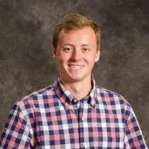

# Congratulations Dr. Daniel Dudt! 🎓

Dr. Daniel Dudt has successfully defended his thesis on “stellarator optimization” this 2024, marking a significant milestone in his academic journey. His rigorous research and innovative approach have culminated in his next role as a Senior Scientist at Thea Energy.

<!-- more --> 

Best wishes on your exciting journey ahead!