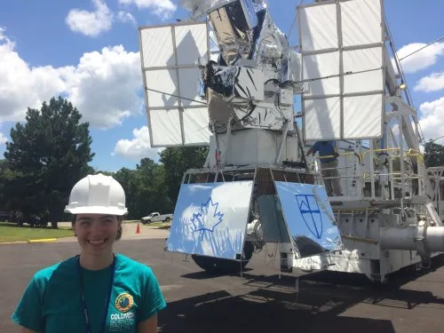

# Congratulations Dr. Susan Redmond! 🌟

Dr. Susan Redmond showcased her scholarly excellence in 2023 with her defense of "Correction of Quasi-Static Wavefront Error Drifts in Wide-Field and High-Contrast Imaging Telescopes."

<!-- more --> 

Your next adventure as a Postdoc at Caltech promises to be just as groundbreaking. We’re all cheering for your continued success and discoveries!