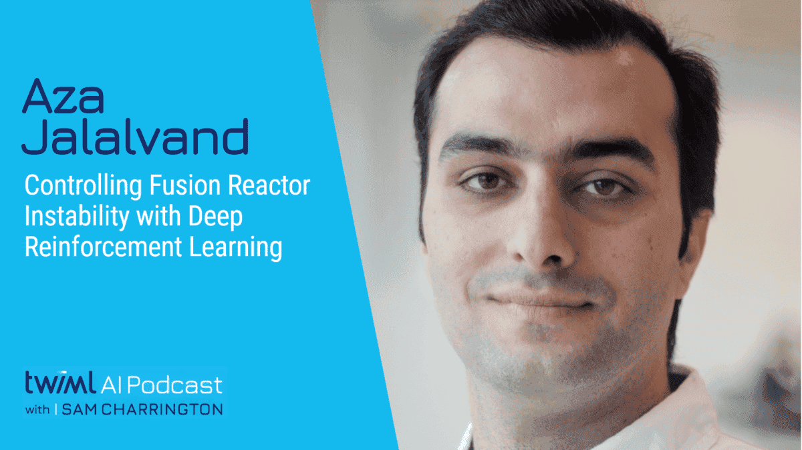

# Video: Controlling Fusion Reactor Instability with Deep Reinforcement Learning with Aza Jalalvand

Watch PCG Research Scientist Aza Jalalvand talk about machine learning and fusion on the TWIML podcast.

<!-- more -->

<iframe width="560" height="315" src="https://www.youtube.com/embed/bn41x3gEMNI?si=bodRUMHLvr-xewBc" title="YouTube video player" frameborder="0" allow="accelerometer; autoplay; clipboard-write; encrypted-media; gyroscope; picture-in-picture; web-share" referrerpolicy="strict-origin-when-cross-origin" allowfullscreen></iframe>

