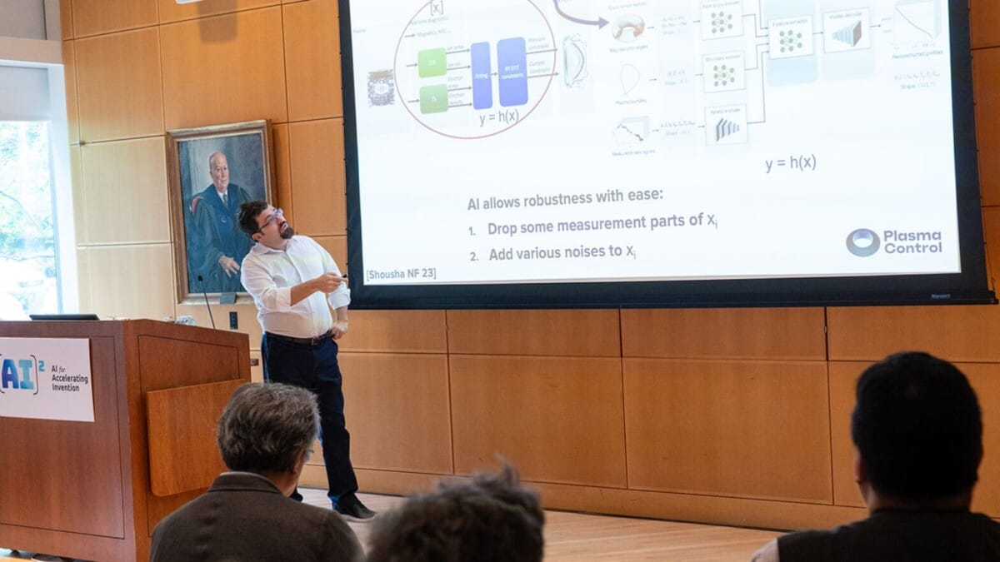
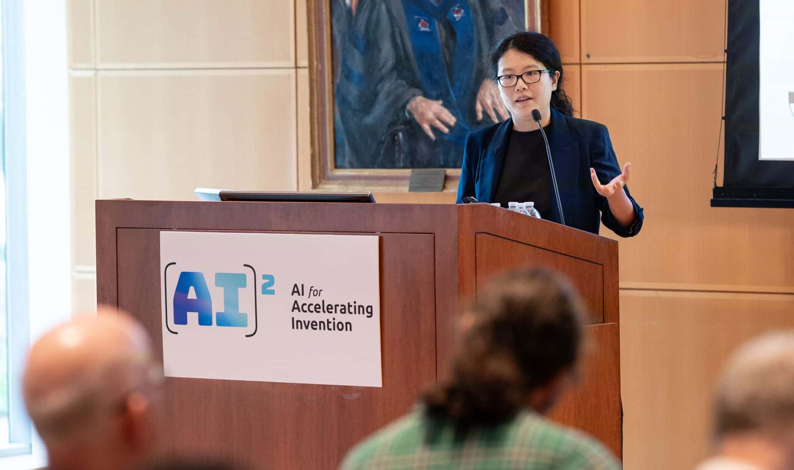
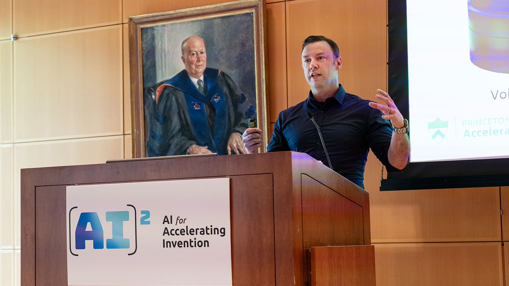

# Initiative Aims to Make Princeton a Leader in AI Accelerated Engineering

As a part of a broad set of investments around artificial intelligence, Princeton University has launched AI for Accelerating Invention, an initiative to achieve faster breakthroughs across engineering disciplines, including biomedicine, robotics and nuclear fusion.

<!-- more -->

<iframe width="560" height="315" src="https://www.youtube.com/embed/q4kOZ3tJZk0?si=tYJcaeuPNhSy_E2H" title="YouTube video player" frameborder="0" allow="accelerometer; autoplay; clipboard-write; encrypted-media; gyroscope; picture-in-picture; web-share" referrerpolicy="strict-origin-when-cross-origin" allowfullscreen></iframe>

“What we have the opportunity to do here is to transform engineering by taking this tool and using it in ways that haven’t yet been imagined,” said Andrea Goldsmith, dean of the School of Engineering and Applied Science and the Arthur LeGrand Doty Professor of Electrical and Computer Engineering at the launch event Aug. 29. “We have an opportunity to lead.”

Mengdi Wang, associate professor of electrical and computer engineering and the Center for Statistics and Machine Learning, and Ryan Adams, professor of computer science lead the initiative.

AI for Accelerating Invention is one of three research initiatives, including Natural and Artificial Minds and Princeton Language and Intelligence, which round out the Princeton Laboratory for Artificial Intelligence (AI Lab).

Using AI to push the frontier

The Aug. 29 event celebrated the launch of AI for Accelerated Invention with flash talks by ten Princeton engineering faculty members who showed how they use artificial intelligence as a tool in their research. Among the presenters were:

Cliff Brangwynne, professor of chemical and biological engineering and director of the Omenn-Darling Bioengineering Institute, is researching the assembly of organelles — the specialized structures within living cells. Using neural network-based analyses of images and classification, his lab is developing approaches to understand the structures of organelles and how they function. Brangwynne’s lab is pioneering efforts to use this research to engineer synthetic organelles for biomedical and biotechnology applications.

Egemen Kolemen, associate professor of mechanical and aerospace engineering and the Andlinger Center for Energy and the Environment, is using artificial intelligence to make an operational fusion reactor better. Fusion reactors under development contain super-heated particles within a donut-shaped device known as a tokamak. These particles form an unruly state of matter called a plasma, which are subject to instabilities that can ruin the reaction. Kolemen and his team found they could model the dynamics occurring within the tokamak with the help of AI. Through modeling the plasma dynamics, AI allows for researchers to exert better control over the reaction — thus maximizing fusion power while keeping a reactor stable.

Jaime Fernández Fisac, assistant professor of electrical and computer engineering, and his colleagues in the Safe Robotics Laboratory are using machine learning methods to work toward ensuring safety in human interactions with robotic systems. In their work to reconcile safety and performance, the group has designed safety filters, which use a reinforcement learning algorithm to monitor the operations of autonomous systems and intervene to prevent failure and hazardous behavior.

Ellen Zhong, assistant professor of computer science, and her colleagues developed software that uses machine learning to create 3D reconstructions of structures imaged by cryo-electron microscopy. These powerful microscopes produce millions of two-dimensional images that need to be carefully assembled to represent a three-dimensional image. Zhong’s software, CryoDRGN, uses a neural network to directly reconstruct the structures of molecules such as proteins, which carry out the functions necessary for biological life. With cryoDRGN mapping the 3D structures of these essential molecules, researchers could piece together a better understanding of proteins and the ways in which they function.

“I was impressed by the breadth and depth of our engineering faculty, and the possibilities for using AI to push the frontier,” said Wang of the talks given at the AI^2 launch. “AI is not a stand-alone technology and we really need to work together to scale up things.”

“Researchers here at Princeton are tackling the most challenging and important scientific problems our society faces, with enthusiasm and creativity,” said Adams. “Our hope is that a collaborative community around artificial intelligence can amplify the capabilities of everyone at Princeton to achieve new scientific heights.”

By Allison Gasparini.

[Link](https://engineering.princeton.edu/news/2024/09/18/initiative-aims-make-princeton-leader-ai-accelerated-engineering) to original article