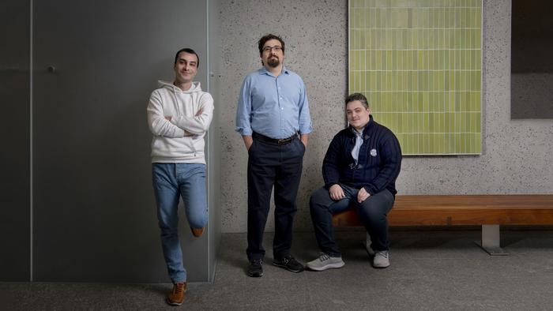

# Our 2024 breakthrough in nuclear fusion with artificial intelligence

Read about our research, led by Egemen Kolemen and conducted by researchers including Jaemin Seo, SangKyeun Kim, and Azarakhsh Jalalvand, affiliated with Princeton University and Princeton Plasma Physics Lab (PPPL).

<!-- more -->

[Engineers use AI to wrangle fusion power for the grid- Princeton Engineering](https://engineering.princeton.edu/news/2024/02/21/engineers-use-ai-wrangle-fusion-power-grid)

[Scientists May Have Tamed Fusion's #1 Nemesis (Popular Mechanics)](https://www.popularmechanics.com/science/energy/a46973142/nuclear-fusion/)

[Princeton researchers found a way to stabilize fusion energy](https://www.cnn.com/2024/02/21/climate/nuclear-fusion-ai-climate-solution/index.html)

[Scientists Claim AI Breakthrough to Generate Boundless Clean Fusion Energy (vice.com)](https://www.vice.com/en/article/y3w4am/scientists-claim-ai-breakthrough-to-generate-boundless-clean-fusion-energy)

[AI solves nuclear fusion puzzle for near-limitless clean energy | The Independent](https://www.independent.co.uk/tech/nuclear-fusion-ai-clean-energy-b2500756.html)

[AI Model Boosts Scientists' Nuclear Fusion Energy Dream -- IS (asiafinancial.com)](https://www.asiafinancial.com/ai-model-boosts-scientists-nuclear-fusion-energy-dream-is)

[Scientists Design AI That Can Stabilize Fusion Reactors | Extremetech](https://www.extremetech.com/science/scientists-design-ai-that-can-stabilize-fusion-reactors)

[AI Can Predict and Prevent Fusion Reaction Instabilities -- Securities.io](https://www.securities.io/ai-can-predict-and-prevent-fusion-reaction-instabilities/)

[AI Just Cleared A Big Hurdle On The Road To Nuclear Fusion Energy | IFLScience](https://www.iflscience.com/ai-just-cleared-a-big-hurdle-on-the-road-to-nuclear-fusion-energy-73107)

[Scientists Say AI Could Solve Key Problem in Quest for Nuclear Fusion | RealClearEnergy](https://www.realclearenergy.org/2024/02/26/scientists_say_ai_could_solve_key_problem_in_quest_for_nuclear_fusion_1013725.html)

[Nuclear fusion meets AI: stable plasma through machine learning -- NotebookCheck.net News](https://www.notebookcheck.net/Nuclear-fusion-meets-AI-stable-plasma-through-machine-learning.807595.0.html)

[Near-Unlimited Energy a Step Closer As Scientists Overcome Fusion Problem (newsweek.com)](https://www.newsweek.com/near-unlimited-energy-overcome-nuclear-fusion-problem-ai-1872066)

[USA: nuclear fusion, Princeton University uses AI to stabilize plasma (agenzianova.com)](https://www.agenzianova.com/en/news/USA-nuclear-fusion-Princeton-University-uses-artificial-intelligence-to-stabilize-plasma/)

[AI can now forecasts nuclear fusion reactor instabilities in real time (interestingengineering.com)](https://interestingengineering.com/innovation/ai-to-forecast-real-time-plasma-instabilities-in-nuclear-fusion-reactor)

  <iframe width="560" height="315" src="https://www.youtube.com/embed/N1eoXkzL6WY?si=h3-bNcVfe42MT9y5" title="YouTube video player" frameborder="0" allow="accelerometer; autoplay; clipboard-write; encrypted-media; gyroscope; picture-in-picture; web-share" referrerpolicy="strict-origin-when-cross-origin" allowfullscreen></iframe>

