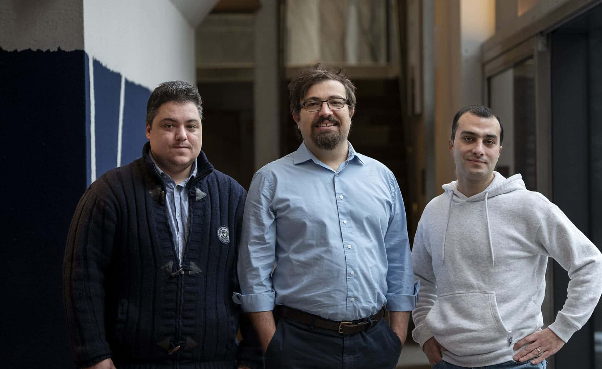

# Using AI to wrangle fusion energy

> During a fusion reaction, every millisecond matters.

In the blink of an eye, the unruly, superheated plasma that drives nuclear fusion can escape from its magnetic confinement within the donut-shaped device, or tokamak, designed to contain it. These getaways frequently spell the end of the reaction, posing a core challenge to developing fusion as a non-polluting, virtually limitless energy source.

<!-- more -->

But a team led by [Egemen Kolemen](https://engineering.princeton.edu/faculty/egemen-kolemen), associate professor of [mechanical and aerospace engineering](https://mae.princeton.edu/) and the [Andlinger Center for Energy and the Environment](https://acee.princeton.edu/), has trained an AI controller to predict and then avoid a type of plasma instability in real time.

The team first trained the controller on data from past experiments at the [DIII-D National Fusion Facility](https://d3dfusion.org/) in San Diego. They then demonstrated that the controller could learn from past experiments to predict the likelihood of instability during new fusion experiments and adjust specific reactor parameters in a matter of milliseconds to avoid the instability from ever forming.

The researchers showed their model could forecast potential plasma instabilities known as tearing mode instabilities up to 300 milliseconds in advance. While that leaves no more than enough time for a slow blink in humans, it was plenty of time for the AI controller to change certain operating parameters to avoid what would have developed into a tear within the plasma’s magnetic field lines, upsetting its equilibrium and opening the door for a reaction-ending escape.

“By learning from past experiments, rather than incorporating information from physics-based models, the AI could develop a final control policy that supported a stable, high-powered plasma regime in real time, at a real reactor,” said Kolemen, who is also a staff research physicist at the [Princeton Plasma Physics Laboratory](https://www.pppl.gov/) (PPPL).

The research opens the door for more dynamic control of a fusion reaction than current approaches, and it provides a foundation for using artificial intelligence to solve a broad range of plasma instabilities, which have long been obstacles to achieving a sustained fusion reaction.

“Previous studies have generally focused on either suppressing or mitigating the effects of these tearing instabilities after they occur in the plasma,” said first author [Jaemin Seo](https://physics.cau.ac.kr/BM/bm_1_view.php?idx=76), an assistant professor of physics at Chung-Ang University in South Korea who performed much of the work while a postdoctoral researcher in Kolemen’s group. “But our approach allows us to predict and avoid those instabilities before they ever appear.”

While the researchers said the work is a promising proof-of-concept demonstrating how artificial intelligence can effectively control fusion reactions, it is only one of many next steps already ongoing in Kolemen’s group to advance the field of fusion research.

The first step is to get more evidence of the AI controller in action at the DIII-D tokamak, and then expand the controller to function at other tokamaks.

A second line of research involves expanding the algorithm to handle many different control problems at the same time. While the current model uses a limited number of diagnostics to avoid one specific type of instability, the researchers could provide data on other types of instabilities and give access to more knobs for the AI controller to tune, potentially allowing it to control for several types of instabilities simultaneously.

And on the route to developing better AI controllers for fusion reactions, researchers might also gain more understanding of the underlying physics. By studying the AI controller’s decisions as it attempts to contain the plasma, which can be radically different than what traditional approaches might prescribe, artificial intelligence may be not only a tool to control fusion reactions but also a teaching resource.

“Eventually, it may be more than just a one-way interaction of scientists developing and deploying these AI models,” said Kolemen. “By studying them in more detail, they may have certain things that they can teach us too.”

