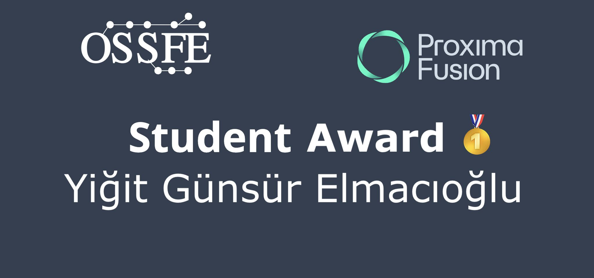

# Video: Yigit Elmacioglu Wins OSSFE Best Student Talk Award

Yigit Gunsur Elmacioglu, PhD student at Princeton University MAE department, won the best student talk award at the first-ever Open-Source Software for Fusion Energy (OSSFE) conference for his presentation “DESC: Stellarator Equilibrium and Optimization Code“.

<!-- more -->

<iframe width="560" height="315" src="https://www.youtube.com/embed/cxqWrc7YopE" title="YouTube video player" frameborder="0" allow="accelerometer; autoplay; clipboard-write; encrypted-media; gyroscope; picture-in-picture; web-share" referrerpolicy="strict-origin-when-cross-origin" allowfullscreen></iframe>

