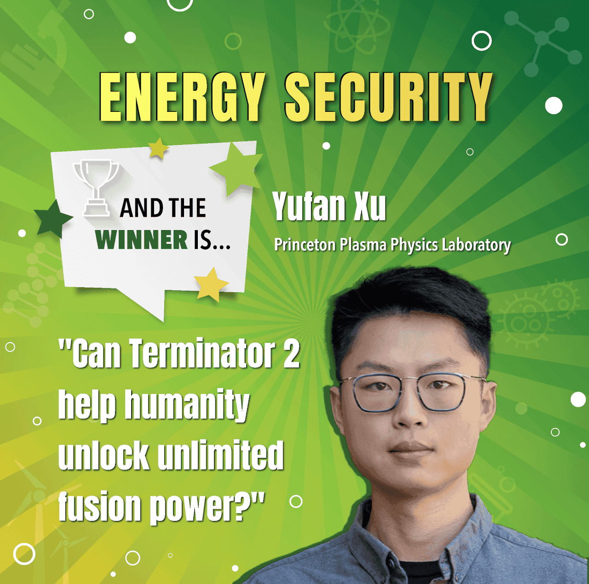

# Video: Yufan Xu Wins National Lab Research Slam Award

Yufan Xu, a postdoctoral researcher at PPPL, won the National Lab Research SLAM award for his talk, “Can Terminator 2 Help Humanity Unlock Unlimited Fusion Energy?”

<!-- more -->

<iframe width="560" height="315" src="https://www.youtube.com/embed/zccX3Lx1EP4?si=AhcnpJnscM5-SbLV&amp;start=5085" title="YouTube video player" frameborder="0" allow="accelerometer; autoplay; clipboard-write; encrypted-media; gyroscope; picture-in-picture; web-share" referrerpolicy="strict-origin-when-cross-origin" allowfullscreen></iframe>

