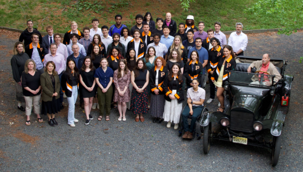

# Luc Harbers awarded Sigma Xi award during class day 2025

Luc Harbers wins Sigma Xi award during class day 2025 for his outstanding academic achievement in MAE. Luc has worked with Francisco Saenz on a liquid coil stellarator  for his senior thesis, confirming field shape and current behavior with a prototype slice of the proposed reactor design.

<!-- more -->

[Link](https://mae.princeton.edu/about-mae/news/class-day-celebrates-2025-graduates) to original article.