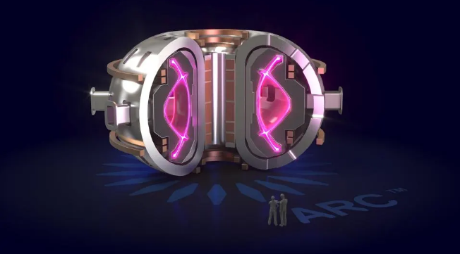

# Private Sector Advances Nuclear Fusion With AI – New Plant To Open Soon

“By learning from past experiments, rather than incorporating information from physics-based models, the AI could develop a final control policy that supported a stable, high-powered plasma regime in real time, at a real reactor,” said Princeton Plasma Physics Laboratory research leader Egemen Kolemen at the time, about a year ago.

<!-- more -->

[Link](https://www.forbes.com/sites/johnwerner/2025/01/18/private-sector-advances-nuclear-fusion-with-ai--new-plant-to-open-soon/) to original article.