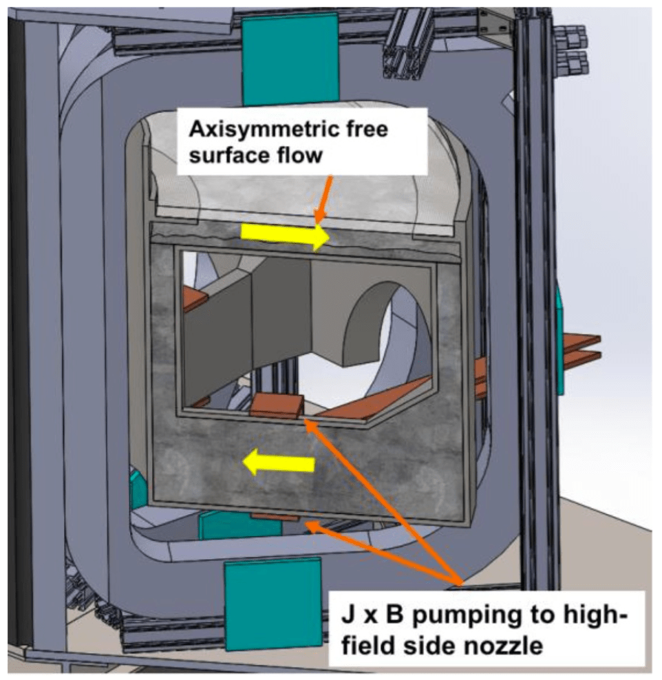
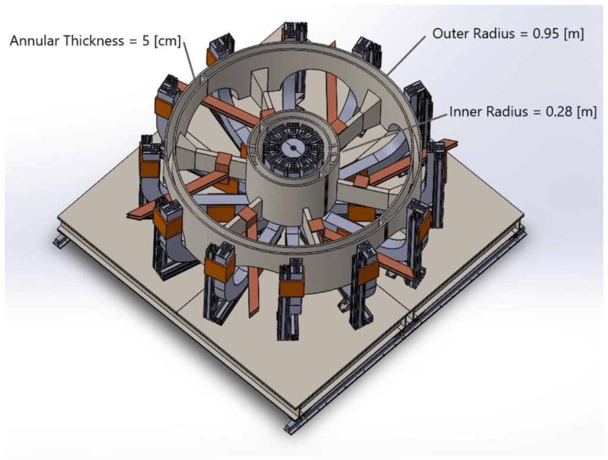
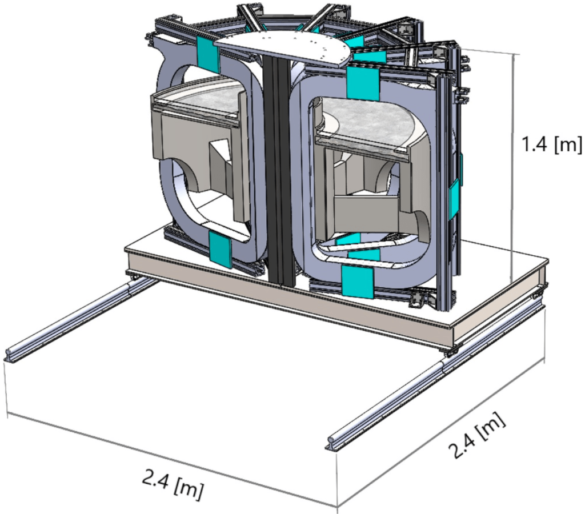

# Flowing Liquid Metal Torus (FLIT)

FLIT is a fully-axisymmetric, free-surface liquid metal test stand equipped with a full set of toroidal field coils. The final design review has been completed and approved–fabricaiton has not yet begun.

When completed FLIT will provide a reactor-relevant test-stand for fast-flowing, free-surface liquid metal divertor concepts using galinstan as the working fluid.

