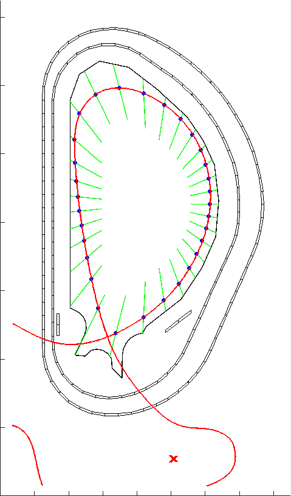
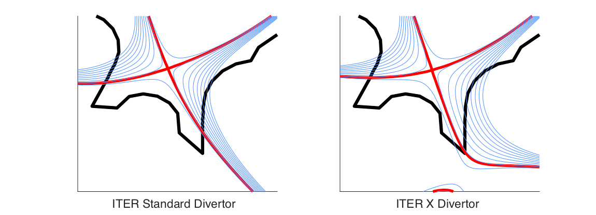
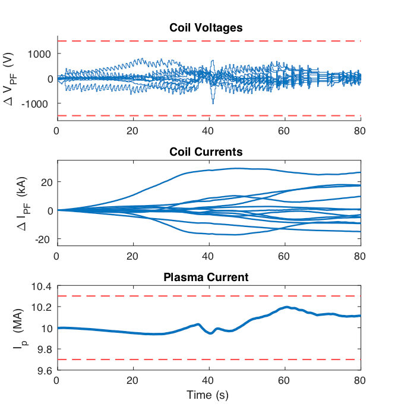

# X-Divertor Control for ITER

The divertor is a device inside a tokamak used to absorb the energy from particle impurities that generate within the plasma volume, with beneficial effects to the plasma. As such, the divertor experiences the highest heat and particle flux levels out of all the PFCs in the reactor. For an operational reactor, the estimated levels are near the limit of what conventional materials are capable of (10 MW/m^2).Several ideas have been generated that use different types of magnetic field configurations that would lower heat flux to the divertor. Among these are the snowflake divertor and the x-divertor.In the standard divertor, there is a single magnetic field null (x-point) located in the divertor region. The x-point splits into two legs which intersect with the divertor at the strike points. In the x-divertor a secondary x-point is generated and placed near the outer strike point using shape coils. This expands the poloidal magnetic flux which in turn lowers the heat flux to the divertor.

Creating the x-divertor in ITER is difficult because there are no special close-in divertor coils. The poloidal field (PF) shaping coils are thus pushed to their limits in attempting this geometry. For this reason, we use model predictive control, a control paradigm with explicit handling of inequality constraints. It’s shown that for a 10MA plasma, the x-divertor can be created while keeping all coils below limits, maintaining shape, and maintaining strike point positions.

