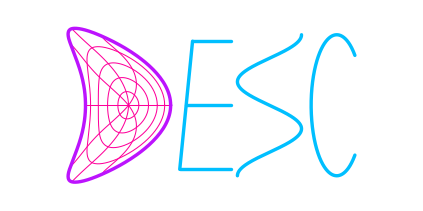

# Stellarator Optimization Package

DESC solves for and optimizes 3D MHD equilibria using pseudo-spectral
numerical methods and automatic differentiation.

The theoretical approach and implementation details used by DESC are
presented in the following papers and documented at
[Theory](https://desc-docs.readthedocs.io/en/latest/theory_general.html).
Please cite our work if you use DESC!

-   Dudt, D. & Kolemen, E. (2020). DESC: A Stellarator Equilibrium
    Solver. \[[Physics of Plasmas](https://doi.org/10.1063/5.0020743)\]
    \[[pdf](https://github.com/PlasmaControl/DESC/blob/master/publications/dudt2020/dudt2020desc.pdf)\]
-   Panici, D. et al (2023). The DESC Stellarator Code Suite Part I:
    Quick and accurate equilibria computations. \[[Journal of Plasma
    Physics](https://doi.org/10.1017/S0022377823000272)\]
    \[[pdf](https://github.com/PlasmaControl/DESC/blob/master/publications/panici2022/Panici_DESC_Stellarator_suite_part_I_quick_accurate_equilibria.pdf)\]
-   Conlin, R. et al. (2023). The DESC Stellarator Code Suite Part II:
    Perturbation and continuation methods. \[[Journal of Plasma
    Physics](https://doi.org/10.1017/S0022377823000399)\]
    \[[pdf](https://github.com/PlasmaControl/DESC/blob/master/publications/conlin2022/conlin2022perturbations.pdf)\]
-   Dudt, D. et al. (2023). The DESC Stellarator Code Suite Part III:
    Quasi-symmetry optimization. \[[Journal of Plasma
    Physics](https://doi.org/10.1017/S0022377823000235)\]
    \[[pdf](https://github.com/PlasmaControl/DESC/blob/master/publications/dudt2022/dudt2022optimization.pdf)\]

## Quick Start

The easiest way to install DESC is from PyPI: `pip install desc-opt`

For more detailed instructions on installing DESC and its dependencies,
see
[Installation](https://desc-docs.readthedocs.io/en/latest/installation.html).

The best place to start learning about DESC is our tutorials:

-   [Basic fixed boundary
    equilibrium](https://desc-docs.readthedocs.io/en/latest/notebooks/tutorials/basic_equilibrium.html):
    running from a VMEC input, creating an equilibrium from scratch
-   [Advanced
    equilibrium](https://desc-docs.readthedocs.io/en/latest/notebooks/tutorials/advanced_equilibrium_continuation.html):
    continuation and perturbation methods.
-   [Free boundary
    equilibrium](https://desc-docs.readthedocs.io/en/latest/notebooks/tutorials/free_boundary_equilibrium.html):
    vacuum and or finite beta with external field.
-   [Using DESC
    outputs](https://desc-docs.readthedocs.io/en/latest/notebooks/tutorials/use_outputs.html):
    analysis, plotting, saving to VMEC format.
-   [Basic
    optimization](https://desc-docs.readthedocs.io/en/latest/notebooks/tutorials/basic_optimization.html):
    specifying objectives, fixing degrees of freedom.
-   [Advanced
    optimization](https://desc-docs.readthedocs.io/en/latest/notebooks/tutorials/advanced_optimization.html):
    advanced constraints, precise quasi-symmetry, constrained
    optimization.
-   [Near axis
    constraints](https://desc-docs.readthedocs.io/en/latest/notebooks/tutorials/nae_constraint.html):
    loading solutions from QSC/QIC and fixing near axis expansion.
-   [Coil
    optimization](https://desc-docs.readthedocs.io/en/latest/notebooks/tutorials/coil_stage_two_optimization.html):
    \"second stage\" optimization of magnetic coils.

For details on the various objectives, constraints, optimizable objects
and more, see the full [api
documentation](https://desc-docs.readthedocs.io/en/latest/api.html).

If all you need is an equilibrium solution, the simplest method is
through the command line by giving an input file specifying the
equilibrium and solver options, this way can also can also accept VMEC
input files.

The code is run using the syntax `desc <path/to/inputfile>` and the full
list of command line options are given in [Command Line
Interface](https://desc-docs.readthedocs.io/en/latest/command_line.html).
(Note that you may have to prepend the command with `python -m`)

Refer to [Inputs](https://desc-docs.readthedocs.io/en/latest/input.html)
for documentation on how to format the input file.

The equilibrium solution is output in a HDF5 binary file, whose format
is detailed in
[Outputs](https://desc-docs.readthedocs.io/en/latest/output.html).

## Repository Contents

-   [desc](https://github.com/PlasmaControl/DESC/tree/master/desc)
    contains the source code including the main script and supplemental
    files. Refer to the
    [API](https://desc-docs.readthedocs.io/en/latest/api.html)
    documentation for details on all of the available functions and
    classes.
-   [docs](https://github.com/PlasmaControl/DESC/tree/master/docs)
    contains the documentation files.
-   [tests](https://github.com/PlasmaControl/DESC/tree/master/tests)
    contains routines for automatic testing.
-   [publications](https://github.com/PlasmaControl/DESC/tree/master/publications)
    contains PDFs of publications by the DESC group, as well as scripts
    and data to reproduce the results of these papers.

## Contribute

-   [Contributing
    guidelines](https://github.com/PlasmaControl/DESC/blob/master/CONTRIBUTING.rst)
-   [Issue Tracker](https://github.com/PlasmaControl/DESC/issues)
-   [Source Code](https://github.com/PlasmaControl/DESC/)
-   [Documentation](https://desc-docs.readthedocs.io/)