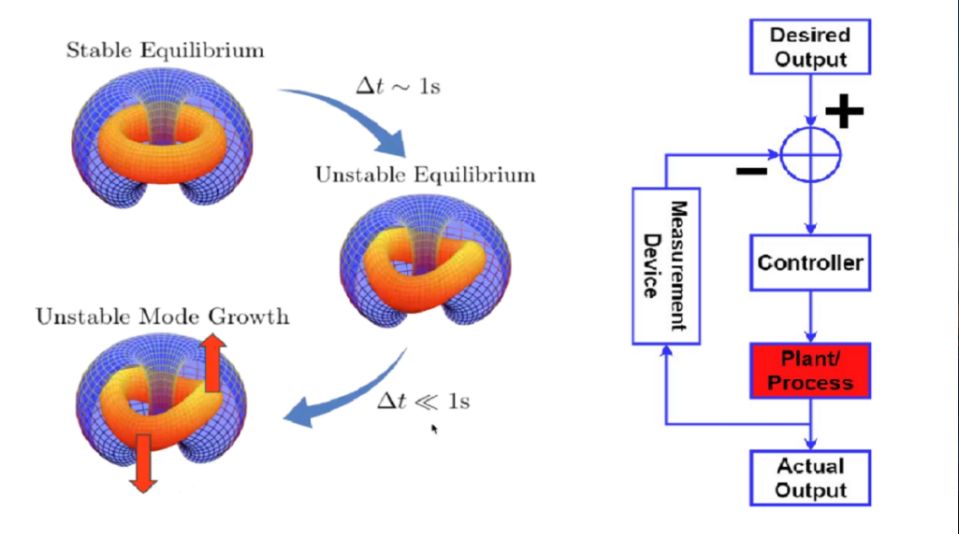

# Using AI to wrangle fusion energy

Talk given by Dr. Egemen Kolemen during the 3/28/2024 colloquia co-hosted by the Institute of Natural Sciences of SJTU, and the School of Nuclear Science and Technology of USTC.

<!-- more -->

<iframe width="560" height="315" src="https://www.youtube.com/embed/Ci4dRFrbHG0?si=sA9iO1arCB4kV_FM" title="YouTube video player" frameborder="0" allow="accelerometer; autoplay; clipboard-write; encrypted-media; gyroscope; picture-in-picture; web-share" referrerpolicy="strict-origin-when-cross-origin" allowfullscreen></iframe>

