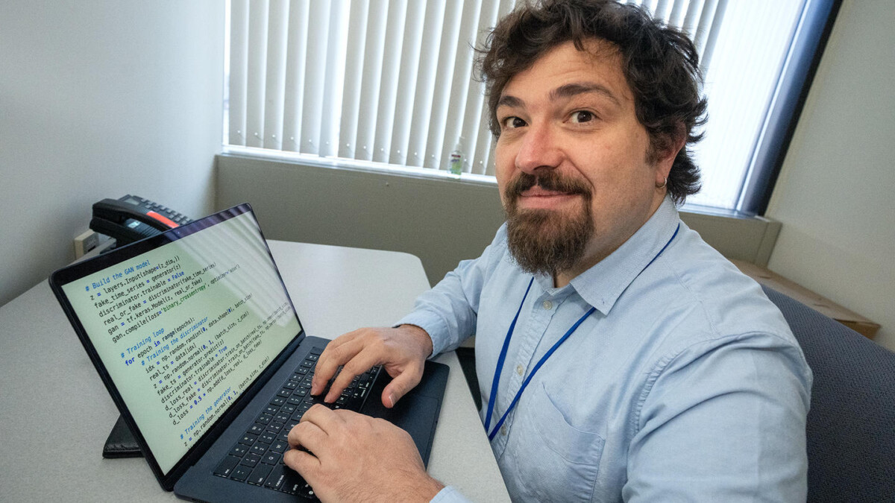

---
date:
  created: 2024-08-14
authors:
  - plasmacontrol
categories:
  - News
---

# Egemen Kolemen wins American Nuclear Society’s Technical Accomplishment Award

Egemen Kolemen, a staff research physicist at the U.S. [Department of Energy](https://www.energy.gov/)'s (DOE) [Princeton Plasma Physics Laboratory](https://www.pppl.gov/) (PPPL) and an associate professor of mechanical and aerospace engineering at [Princeton University](https://www.princeton.edu/), was awarded the [American Nuclear Society's.](https://www.ans.org/) (ANS) 2024 [Technical Accomplishment Award](https://fed.ans.org/awards/tarules/) for his research on using machine learning for controlling fusion reactors.

<!-- more --> 

This award, announced at the ANS Technology of Fusion Energy Meeting in July, is given to a researcher and ANS member who exemplifies professional excellence and high-caliber leadership in the fusion science and engineering area.

"I'm very proud to be acknowledged by the American Nuclear Society. I'm grateful that my group's contributions to the field are being recognized," said Kolemen, who is also the director of the University's program in sustainable energy. 

Kolemen joined Princeton's faculty as an associate professor in 2021. He earned his bachelor's degree in mechanical engineering from Boğaziçi University in Istanbul and his doctoral degree in mechanical and aerospace engineering from Princeton University. 

Kolemen's group, the [Plasma Control Group](https://control.princeton.edu/egemen-kolemen/), has spent years developing machine learning computer code for controlling fusion reactors so the plasma within remains stable and high performing. The ideal result is optimized confinement and commercial fusion power production. 

His research, featured in a paper in [Nature](https://www.nature.com/articles/s41586-024-07024-9) in early 2024, has supported the development of commercially viable fusion energy systems.

"The work that Egemen and his group has done is vital for developing a sustainable energy source for the future," said [Michael Ford](https://www.pppl.gov/michael-ford), associate laboratory director for engineering. "His efforts in growing our understanding of these concepts is most deserving of this recognition from ANS."

Kolemen was also recognized for his fusion research in 2020. He won an [Excellence in Fusion Engineering award](https://www.pppl.gov/news/2020/egemen-kolemen-wins-2020-excellence-fusion-engineering-award) presented by Fusion Power Associates for his work regarding liquid metal usage for fusion power reactors and his contributions to fusion efforts in multiple countries worldwide.