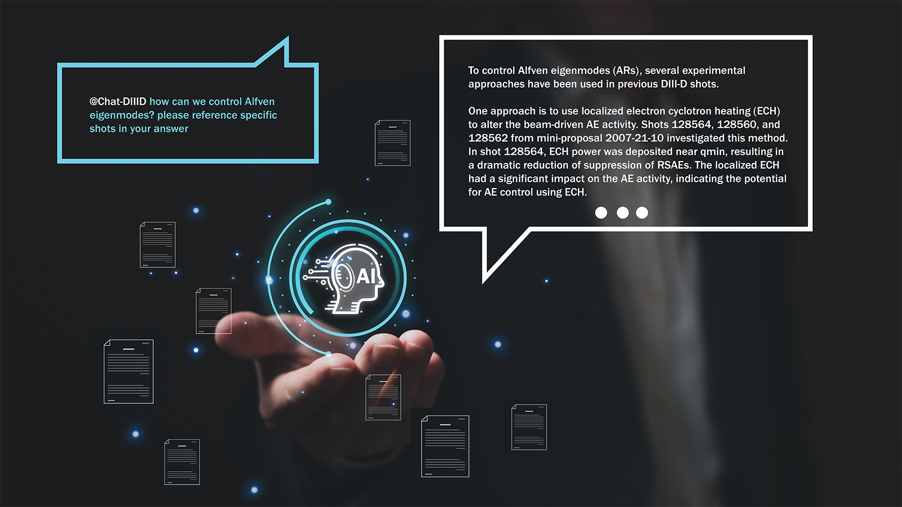

# Leveraging language models for fusion energy research

Since the advent of fusion research, scientists have published thousands of documents on the subject — papers, conference proceedings, and even written logs from previous experiments at fusion reactors around the world. Such a wellspring of information would easily take a lifetime to read, and even longer to comprehend.

<!-- more -->

During an actual fusion experiment at the [DIII-D National Fusion Facility](https://www.ga.com/magnetic-fusion/diii-d) in San Diego, though, researchers have only around 10 minutes between trials to locate that information and use it to make adjustments for the next run.

“Each fusion shot is over in a matter of seconds, and then you have a narrow window of time before the next one to troubleshoot any issues and make any necessary changes,” said [Joseph Abbate](https://plasma.princeton.edu/people/joe-abbate), a sixth-year Ph.D. candidate in the [Princeton Program in Plasma Physics](https://plasma.princeton.edu/). “You have to make a lot of decisions in a very short amount of time.”

Abbate said the researchers leading the experiments routinely work up to the wire to fine-tune the next experiment, and that changes are often made by polling the room for answers, a technique reliant on the shared expertise of the operators on shift that day.

Now, scientists from Princeton University, Carnegie Mellon University, and the Massachusetts Institute of Technology (MIT) have applied large language models — the driving forces behind tools such as ChatGPT, Bard, and LLaMA — to help fusion researchers quickly sift through staggering amounts of data to make more informed decisions on the fly. The model allows users to identify previous experiments with similar characteristics, provide information about a device’s control systems, and return swift answers to questions about fusion reactors and plasma physics.

“Fusion research is, surprisingly, an ideal scenario for applying large language models to assist humans,” said Viraj Mehta, a Ph.D. candidate at Carnegie Mellon University and first author of a [workshop paper](https://openreview.net/forum?id=yGVChrbJ4E) detailing the researchers’ work. “On the one hand, there is a wealth of available writing about fusion in papers, abstracts and posters, as well as in the notes that researchers and operators write after every fusion trial. And on the other hand, you need to have quick access to that information. That’s an area where these models shine.”

The researchers laid the groundwork for their project at a graduate student-led hackathon hosted on Princeton’s campus, during which the team identified adjustments they could make to existing language models to leverage their power for fusion research. Such models have quickly risen to fame for their ability to generate human-like text after being trained on trillions of words across the internet.

In only a few evenings of collaborative coding, the team had built the foundation for their work by enhancing the raw large language model with a process known as retrieval-augmented generation. Retrieval-augmented generation allows one to supplement the model’s general dataset (which is often based on text from the internet published before a specific cutoff date) with additional data sources to improve the accuracy and quality of the model’s responses. In this case, the researchers added a database of information that includes shot logs and notes from previous experiments at DIII-D, which do not exist publicly on the internet.

“At the hackathon, we were able to get instant feedback and inspiration from an entire group of people to keep the project moving forward, allowing us to push past any obstacles and end up with a solid foundation for our model,” Abbate said.

With the augmented model, the researchers received helpful responses to a variety of prompts, from information on how to operate specific pieces of equipment to recommended changes to device parameters. Moreover, they could structure their question to require the model to reference the exact experiments or papers from which it generated its responses, boosting the model’s credibility.

“It’s like having another helper always with you in the room who knows about every fusion trial that’s taken place at the reactor and can provide recommendations based on what’s happened in the past,” said Abbate.

While the researchers laid the groundwork for their model at the hackathon, they have since refined their work so it can be replicated at actual fusion facilities. For instance, Abbate is working with operators at DIII-D to explore ways to implement the framework at the facility, so every research group performing experiments there can access it.

The team also noted the framework can be applied to fusion reactors that are no longer operational, allowing scientists to access a source of information that might otherwise be forgotten as reactor operators either retire or move to other facilities. Coauthor Allen Wang, a graduate student at MIT, demonstrated that the same framework developed for DIII-D could be adapted for Alcator C-Mod, a fusion reactor at MIT that ceased operations in 2016.

“There are machines that have been shut down for a couple of decades, and there’s no one who remembers what happened during those experiments,” said senior author [Egemen Kolemen](https://engineering.princeton.edu/faculty/egemen-kolemen), associate professor of [mechanical and aerospace engineering](https://mae.princeton.edu/) and the Andlinger Center for Energy and the Environment, as well as staff research physicist at the [Princeton Plasma Physics Laboratory](https://www.pppl.gov/) (PPPL). “But by gathering all the text data and plugging them into a language model, we might relearn some key information that can help us solve an issue we face with future reactors.”

Mehta added that the model could also be a valuable tool for younger fusion researchers who serve as session leaders at reactors, a role both he and Abbate have filled multiple times during their graduate careers.

“By having this model that can reference every fusion paper in existence, we have created a tool that allows the next generation of researchers to access information much more easily than before,” he said.

_The paper, “_[_Towards LLMs as Operational Copilots for Fusion Reactors_](https://openreview.net/forum?id=yGVChrbJ4E)_,” was presented Dec. 16 at the NeurIPS 2023 AI for Science Workshop. In addition to Abbate, Mehta, Wang and Kolemen, authors included Andy Rothstein of Princeton and PPPL; Ian Char and Jeff Schneider of Carnegie Mellon University; and Christina Rea and Darren Garnier of MIT._
