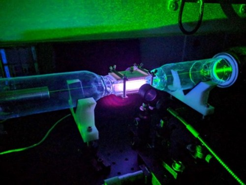

# Laser Diagnostics

In this research area, laser-based advanced Thomson, Raman, and electric field-induced second harmonic generation (E-FISH) diagnostics are used to probe non-equilibrium plasmas. In these plasmas, the gas temperature is much closer to room temperature than fusion plasmas, but the electrons are accelerated by the electric field up to energies of 10 electron volts (eV) or more. Therefore, the plasma is in a non-equilibrium state and can induce chemical reactions at gas temperatures ranging from 300 to 400 K. Our recent work has focused on methane reforming using these low temperature plasmas.

Laser diagnostics have an advantage over physical probes in that they can measure the plasma non-intrusively with high temporal resolution (nanosecond time scale). Thomson scattering can directly probe how many electrons there are in the plasma as well as their temperature. Furthermore, Raman scattering gives rotational and vibrational temperatures of the molecules in the plasma. Often, the rotations and vibrations of molecules in the plasma are not in equilibrium, and the corresponding temperatures are different. Lastly, E-FISH enables measurements of the electric field with high temporal resolution. With these diagnostics, the goal is to build predictive models of plasma formation and plasma-induced chemistry. Then, we can investigate how to control the plasma for enhanced chemical reactivity. For this, high fidelity time-resolved measurements from laser diagnostics are necessary to validate these models.

