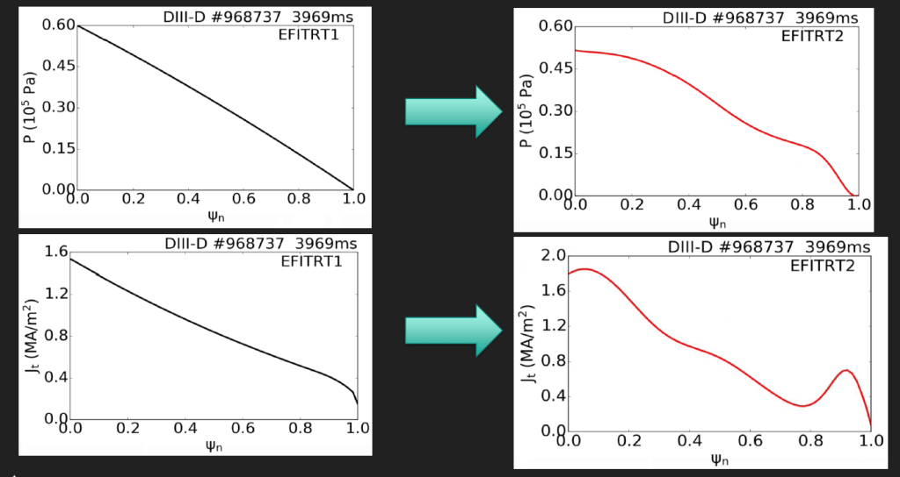
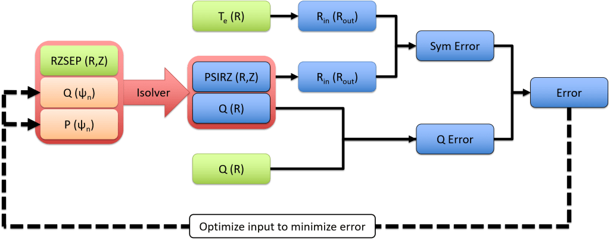
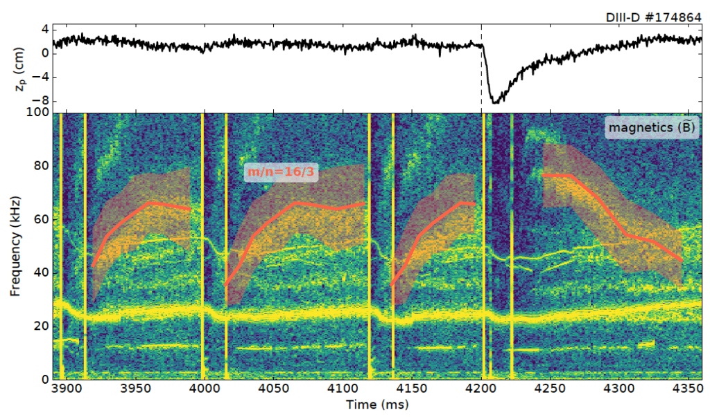
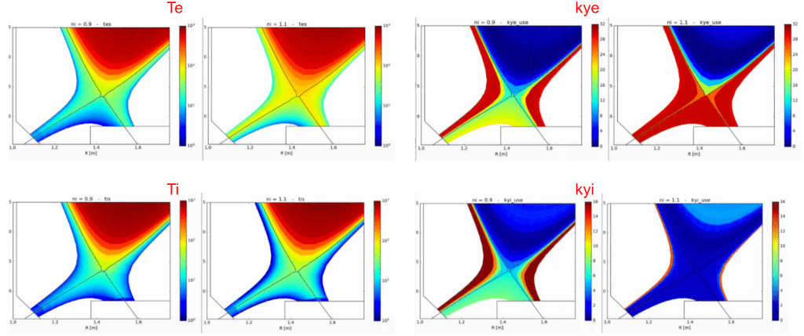
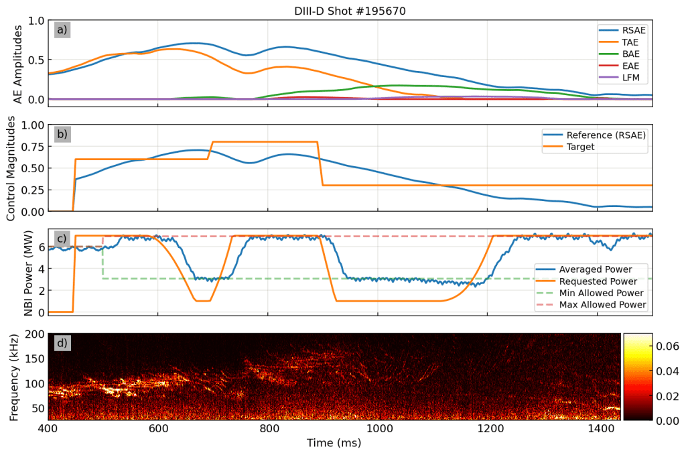
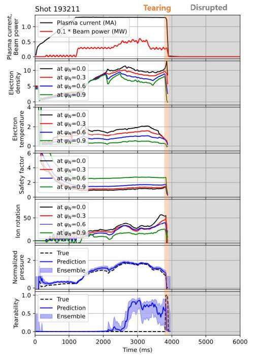
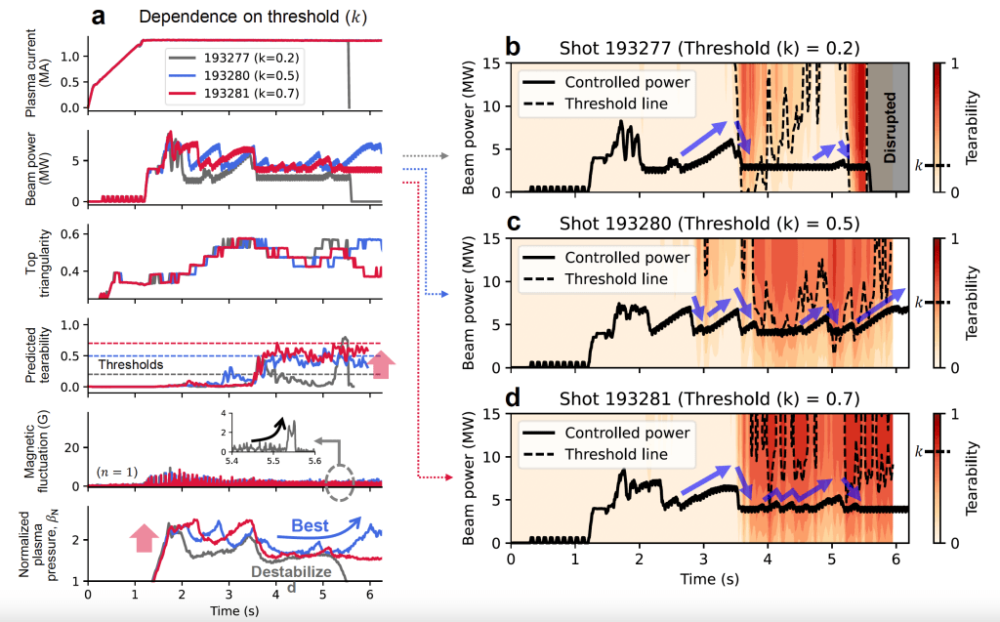

# DIII-D Collaboration

## Real-time Equilibrium Reconstruction with Kinetic Constraints on DIII-D

Summary: The CAKE equilibria reconstruction automatically produces high quality kinetic EFITs on DIII-D shots.

Many discharge relevant parameters can not be measured directly. However, they can be evaluated indirectly from available data from real-time diagnostics. A least squares solution of the diagnostic data to the Grad-Shafranov model allows this evaluation (rtEFIT). The Grad-Shafranov model describes the force balance of the tokamak equilibrium, and allows for a distributed current source. rtEFIT determines the distribution of poloidal flux and toroidal current density in the R,Z-plane.

If kinetic constraints are absent, the pressure profiles and current profiles resulting from equilibrium reconstruction do not exhibit the features that one would typically expect (no pedestal in pressure, no bootstrap peak in current). Our work focuses on using real-time kinetic profile data from diagnostics like Thomson Scattering (TS) and Charge Exchange Recombination Spectroscopy (CER) to generate pressure profile fits (and current profile fits) which are sent to rtEFIT, to be used to constrain the solution of equilibrium reconstruction. See the Figure below for an example of the qualitative improvements to the features of the reconstructed current and pressure profile when the kinetically constrained version is compared against equilibrium reconstruction using only magnetics:

## Advanced ECE and ECCD Applications

Electron Cyclotron Emission (ECE) is a crucial diagnostic for measuring the electron temperature in tokamaks as a function of time and radius. Electron Cyclotron Current Drive (ECCD) is a technique used to inject power into the plasma and can be used to suppress dangerous instabilities. We have long been involved in the development of these system on DIII-D, which has some of the most advanced diagnostic systems in the world. For example, we developed a set of real-time steerable mirrors for the DIII-D system and designed algorithms to reduce the power requirements and time needed to suppress 3/2 and 2/1 neoclassical tearing modes (NTMs). This allows operators to achieve more stable plasmas and avoid disruptions.

Recently, we have been looking into ways to extend the information gathered by ECE to improve equilibrium reconstructions on future machines. We have developed a new algorithm that can generate a fully-constrained kinetic equilibrium using only a ECE diagnostic and an image of the plasma boundary. This will be useful in future machines with intense neutron heat fluxes, since both ECE and plasma imaging can be robustly designed in harsh neutron environments, unlike many other diagnostics commonly employed today. This is made possible by measurement of several different rational q surfaces simultaneously using only a single diagnostic, which allows us to transform the traditional constraints of pressure and current into constrains on electron temperature and q, as depicted here:

## Pedestal Transport Studies

The H-mode pedestal is an extremely important and complicated region of tokamak plasmas. It lies near the plasma edge and is characterized by steep pressure gradients, which are responsible not only for improved plasma performance but also for dangerous transient instabilities called ELMs. In order to better understand these phenomena we are focusing on two separate physics influences: that of neutral ionization and that of micro-instability transport through the pedestal.

To study the effect of neutrals, we are comparing the pedestal structure on similar discharges fueled by pellet injection and gas puffing, which deposit neutrals closer to the core and edge, respectively. We have found that the deposition of neutrals can play a large role in setting the structure of the H-mode pedestal and thus should be considered in predictive models of the pedestal height and width.

In a separate research thrust, we are using novel experimental tools to perturb the edge current in the pedestal region. This allows us to decouple the instability drive and resonant location for micro-tearing modes (MTMs), which are likely responsible for a large portion of the electron heat flux through the pedestal region. This investigation has so far led to the first time-dependent experimental identification of MTMs in an H-mode pedestal, paving the way for future improvements to predictive pedestal models. An example experimental identification of a m/n=16/3 MTM in the H-mode edge is shown here:

## Automated equilibria and SOL modeling on DIII-D

As the understanding of plasma physics progresses, more and more detailed modeling is required to solve the outstanding problems in the field. Unfortunately, much of this modeling requires time-consuming manual oversight, which severely limits our abilities to conduct database studies of large numbers of discharges. On DIII-D, we have developed two automated codes to help with this issue. First, the CAKE code is now operational and regularly provides high-quality automatically-generated kinetic equilibria for use in physics studies. Second, we have recently developed the autoUEDGE algorithm, with self-consistently solves transport equations in the scrape-off-layer (SOL) in order to facilitate database studies of edge plasma transport and to provide improved initial conditions for expert simulations. An example of a converged autoUEDGE transport solution is shown here:

## Real time Alfven Eigenmode Control

Summary: We explore machine learning models to provides insights for controlling fast ion instabilities known as Alfven Eigenmodes.

A real-time machine learning (ML) based Alfven Eigenmode controller was developed and then tested on DIII-D. Two ML models were developed: an AE amplitude predictor capable of predicting amplitudes of RSAE, TAE, BAE, EAE, and LFM based on the high frequency real-time ECE measurements and a neutron rate predictor that predicts the classical neutron rate produced by NUBEAM coupled with TRANSP simulations. The neutral beam power is the main actuator used for AE control since it strongly affects the energetic particle distribution. We used the VEP algorithm to control the neutral beams in order to not only modulate beam duty cycle (on/off), but the individual beam voltages and perveances to allow for finer control. The controller was designed as a basic P-controller based on the AE amplitude model outputs and user set amplitude thresholds. In the experimental plot below, we see nice P-control where the amplitude modulates up and down until the controller tries to push neutral beam power high but runs into the power limit.

## Real Time Tearing Mode Control

Summary: Tearing modes are a large threat to high performance tokamak operation so our group developed a reinforcement learning controller to avoid these instabilities.

A reinforcement-learning (RL) based tearing mode (TM) controller was designed and tested on DIII-D. To build a training environment for the RL controller, a TM predictor was developed using information about the plasma state (profile information such as Te, Ne, q, rotation, pressure) as well as actuator information (NBI and ECH powers and shape parameters). The TM predictor predicts both “Tearability” (a metric for if/how likely a TM is to occur) and Betan (a proxy for plasma “performance”). This predictor allowed for the training of the RL agent by providing a reward function based on the idea of reducing Tearability below a desired threshold while maximizing Betan.

The RL controller was tested in experiment in DIII-D in the ITER Baseline Scenario and at varying thresholds for allowable Tearability. In the trial of multiple threshold values of 0.2, 0.5, and 0.7, the RL agent trained with the 0.5 threshold appeared to perform best in modulated NBI power to successfully avoid TMs while also maintaining reasonable Betan levels.

