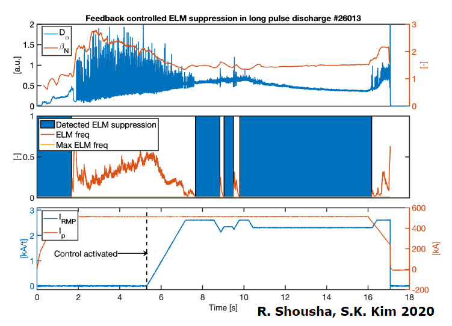

# KSTAR

## Adaptive ELM control

Ideally, tokamak fusion plasmas are operated at high pressure to benefit fusion performance. However, operating a plasma at high pressure typically results in the destabilization of so-called Edge Localized Modes (ELMs). These ELMs are associated with violent quasi-periodic expulsions of particles and heat. Reactor scale tokamaks are expected not to be able to tolerate ELMs, as the heat load will exceed material limits, thereby damaging the device and reducing availability. Resonant magnetic field perturbation (RMP) is a promising method to control ELMs. However, this often leads to considerable confinement degradation, limiting the fusion gain.

To address these critical issues, we are developing a Feedback ELM Controller aimed at achieving and sustaining full ELM suppression through the application of specific 3D Magnetic perturbations, while maximizing the plasma confinement. The Controller we developed so far has been deployed successfully on the KSTAR tokamak device during experiments, where Feedback achieved ELM suppression has been demonstrated repeatedly. Improvements and extensions of the controller are underway. See the Figure below for an example of ELM suppression by our ELM controller during the 2020 KSTAR campaign.

In addition, the controller achieved the longest ELM-suppression discharge (world record). This was possible by strong confinement recovery by adaptive 3D control, which enhances non-inductive current fraction and extends the pulse.

Recently, we are adopting the machine-learning algorithm to make a more advanced ELM controller. The major tasks for this control development are

- ELM precursor detection to avoid the loss of ELM suppression.
- Real-time optimization of the 3D spectrum.
- Radiation, density, beta, q95 control.

We are developing and testing these features in KSTAR recently, and expect that the success of control development will provide an ITER-relevant ELM control method.

### Recent publication

R. Shousha, S.K. Kim, K. G. Erickson, S. H. Hahn, A. O. Nelson, S. M. Yang, J. -K. Park, J. Wai, Y. M. Jeon, J.H. Lee, J. Jang, D. Seo and E. Kolemen "*Design and experimental demonstration of feedback adaptive RMP ELM controller toward complete long pulse ELM suppression on KSTAR*", Physics of Plasmas, DOI: [10.1063/5.0081928](https://doi.org/10.1063/5.0081928)

S.K. Kim, R. Shousha, S. H. Hahn, A. O. Nelson, J. Wai, S. M. Yang, J. -K. Park,  Y. M. Jeon, J.H. Lee, J. Kim, C.Y. Lee, Y.-S. Na and E. Kolemen "*Optimization of 3D controlled ELM-free state with recovered global confinement for KSTAR with n = 1 resonant magnetic field perturbation*", Nuclear Fusion, DOI: [10.1088/1741-4326/ac4369](https://doi.org/10.1088/1741-4326/ac4369)

## MHD modeling on the pedestal stability under RMPs

We are also developing the physics understanding of the role of RMPs on edge pedestal transport and stability. Nonlinear 3D MHD codes are utilized for numerical modeling, and such work will provide physics-based guidance for RMP control.

### Recent publication
S.K. Kim, S. Pamela, N. Logan, Y.-S. Na, C. Y. Lee, J.-K. Park, S. Yang, Q. Hu, M. Becoulet, G. Huisjmans, M. Hoelzl, Y. In, M. Kim, H.H.Lee, J. Lee, O. Kwon and E. Kolemen "*Nonlinear MHD modeling of n=1 RMP-induced pedestal transport and mode coupling effects on ELM suppression in KSTAR*", Nuclear Fusion, DOI: [10.1088/1741-4326/ac84ef](https://doi.org/10.1088/1741-4326/ac84ef)

## 3D Spectroscopy

Coming soon.
